# LAPORAN PROYEK AKHIR SEMESTER

## E-Concalc — Electronic Converter & Calculator

**Platform Kalkulator Ilmiah dan Konverter Berbasis Web & Mobile Android**

---

| | |
|---|---|
| **Judul Proyek** | E-Concalc — Electronic Converter & Calculator |
| **Nama Mahasiswa** | *(Nama Mahasiswa)* |
| **NIM** | *(NIM)* |
| **Dosen** | *(Nama Dosen)* |
| **Program Studi** | Rekayasa Keamanan Siber |
| **Institusi** | Politeknik Siber dan Sandi Negara |
| **Tahun** | 2025 |

---

## KATA PENGANTAR

Puji syukur kehadirat Tuhan Yang Maha Esa atas berkat dan rahmat-Nya sehingga penulis dapat menyelesaikan proyek akhir semester ini dengan baik. Laporan ini disusun sebagai dokumentasi dari proyek **E-Concalc (Electronic Converter & Calculator)**, sebuah platform kalkulator ilmiah dan konverter yang dikembangkan dalam bentuk **aplikasi web** dan **aplikasi mobile Android**.

Proyek ini bertujuan untuk mengimplementasikan konsep pengembangan perangkat lunak full-stack yang mencakup aspek *frontend*, *backend*, *database*, *REST API*, *autentikasi*, serta *keamanan aplikasi*. Penulis berharap proyek ini dapat menjadi kontribusi positif dalam pembelajaran dan praktik pengembangan aplikasi yang aman dan terstruktur.

Penulis mengucapkan terima kasih kepada dosen pembimbing yang telah memberikan arahan selama proses pengembangan, serta semua pihak yang turut membantu penyelesaian proyek ini.

---

## DAFTAR ISI

- [Kata Pengantar](#kata-pengantar)
- [BAB I — Pendahuluan](#bab-i--pendahuluan)
  - [1.1 Latar Belakang](#11-latar-belakang)
  - [1.2 Rumusan Masalah](#12-rumusan-masalah)
  - [1.3 Tujuan](#13-tujuan)
  - [1.4 Manfaat](#14-manfaat)
  - [1.5 Ruang Lingkup](#15-ruang-lingkup)
- [BAB II — Tinjauan Teori dan Teknologi](#bab-ii--tinjauan-teori-dan-teknologi)
  - [2.1 Konsep Dasar Aplikasi Web](#21-konsep-dasar-aplikasi-web)
  - [2.2 Konsep Dasar Aplikasi Mobile](#22-konsep-dasar-aplikasi-mobile)
  - [2.3 Keamanan Aplikasi](#23-keamanan-aplikasi)
- [BAB III — Analisis dan Perancangan Sistem](#bab-iii--analisis-dan-perancangan-sistem)
  - [3.1 Analisis Kebutuhan](#31-analisis-kebutuhan)
  - [3.2 Diagram Sistem](#32-diagram-sistem)
  - [3.3 Arsitektur Sistem](#33-arsitektur-sistem)
- [BAB IV — Implementasi](#bab-iv--implementasi)
  - [4.1 Lingkungan Pengembangan](#41-lingkungan-pengembangan)
  - [4.2 Implementasi Backend](#42-implementasi-backend)
  - [4.3 Implementasi Frontend / Mobile](#43-implementasi-frontend--mobile)
  - [4.4 Integrasi](#44-integrasi)
- [BAB V — Pengujian dan Evaluasi](#bab-v--pengujian-dan-evaluasi)
  - [5.1 Pengujian Fungsional](#51-pengujian-fungsional)
  - [5.2 Pengujian Integrasi](#52-pengujian-integrasi)
  - [5.3 Pengujian Keamanan](#53-pengujian-keamanan)
  - [5.4 Evaluasi](#54-evaluasi)
- [BAB VI — CI/CD dan Deployment](#bab-vi--cicd-dan-deployment)
- [BAB VII — Penutup](#bab-vii--penutup)
  - [7.1 Kesimpulan](#71-kesimpulan)
  - [7.2 Saran](#72-saran)
- [Daftar Pustaka](#daftar-pustaka)
- [Lampiran](#lampiran)

---

## BAB I — PENDAHULUAN

### 1.1 Latar Belakang

Di era digital saat ini, kebutuhan akan alat bantu perhitungan yang cepat, akurat, dan dapat diakses dari berbagai perangkat menjadi semakin penting. Mahasiswa, profesional, dan masyarakat umum seringkali memerlukan kalkulator ilmiah, konverter satuan, maupun konverter mata uang untuk menunjang aktivitas sehari-hari, baik akademik maupun profesional.

Aplikasi kalkulator konvensional umumnya hanya menyediakan operasi dasar dan tidak mendukung sinkronisasi data lintas perangkat. Selain itu, banyak aplikasi kalkulator daring yang tidak memperhatikan aspek keamanan data pengguna, seperti perlindungan autentikasi dan validasi input.

Berangkat dari permasalahan tersebut, penulis mengembangkan **E-Concalc (Electronic Converter & Calculator)** — sebuah platform kalkulator ilmiah dan konverter multi-platform yang terdiri dari **aplikasi web** (Laravel + JavaScript) dan **aplikasi mobile Android** (Kotlin + Jetpack Compose). Platform ini mengimplementasikan autentikasi yang aman, sinkronisasi riwayat perhitungan via REST API, serta prinsip-prinsip keamanan aplikasi sesuai standar OWASP.

### 1.2 Rumusan Masalah

1. Bagaimana merancang dan mengimplementasikan platform kalkulator ilmiah dan konverter yang dapat diakses melalui web dan mobile?
2. Bagaimana mengimplementasikan autentikasi yang aman (username/password dan Google OAuth) dengan sinkronisasi data lintas platform?
3. Bagaimana menerapkan prinsip keamanan aplikasi (CSRF protection, input validation, token-based authentication) pada arsitektur client-server?
4. Bagaimana membangun REST API yang efisien untuk menghubungkan aplikasi web dan mobile dengan satu backend terpadu?

### 1.3 Tujuan

1. Mengembangkan aplikasi kalkulator ilmiah berbasis web dan mobile yang mendukung operasi dasar, trigonometri, logaritma, dan fungsi memori.
2. Mengimplementasikan konverter satuan multi-kategori (panjang, berat, suhu, kecepatan, luas, volume) dan konverter mata uang real-time.
3. Membangun sistem autentikasi yang aman menggunakan Laravel Sanctum (session + token) dan Google OAuth 2.0.
4. Menerapkan REST API untuk sinkronisasi riwayat perhitungan antara web dan mobile.
5. Menerapkan prinsip keamanan aplikasi meliputi CSRF protection, input validation, password hashing, dan token-based authentication.

### 1.4 Manfaat

**Manfaat Akademik:**
- Mengimplementasikan konsep pengembangan perangkat lunak full-stack (frontend, backend, database, API).
- Mempraktikkan pembuatan UML diagram (Use Case, Activity, Sequence, Class, ERD) sebagai dokumen perancangan.
- Memahami arsitektur MVC (web) dan MVVM (mobile) secara langsung.

**Manfaat Praktis:**
- Menyediakan alat hitung ilmiah yang ringan, cepat, dan dapat diakses dari browser maupun smartphone.
- Mendukung mode offline untuk guest user melalui localStorage dan PWA.
- Konverter mata uang dengan kurs real-time untuk kebutuhan sehari-hari.

**Manfaat Keamanan:**
- Pemahaman implementasi autentikasi berbasis token (Laravel Sanctum) dan OAuth 2.0.
- Penerapan praktik keamanan: CSRF tokens, password hashing (bcrypt), input validation, dan HTTPS-ready deployment.

### 1.5 Ruang Lingkup

**Fitur Utama:**
- Kalkulator ilmiah (operasi dasar, trigonometri, logaritma, faktorial, pangkat, akar, fungsi memori, DEG/RAD mode, 2nd function, keyboard input)
- Konverter satuan (6 kategori: panjang, berat, suhu, kecepatan, luas, volume)
- Konverter mata uang (160+ mata uang, kurs real-time via Exchange Rate API)
- Autentikasi user (Login/Register + Google OAuth)
- Sinkronisasi riwayat perhitungan via REST API
- Mode Guest (semua fitur tanpa login, localStorage only)
- Progressive Web App (PWA)

**Platform:**
- Web: Laravel 10, PHP 8.1+, MySQL 8.0, JavaScript ES6+
- Mobile: Kotlin 2.0+, Jetpack Compose, Material 3, Retrofit 2

**Batasan:**
- Konverter mata uang memerlukan koneksi internet untuk update kurs (mendukung cache offline).
- Sinkronisasi riwayat memerlukan koneksi ke backend server.
- Aplikasi mobile hanya mendukung Android (API 24+).

---

## BAB II — TINJAUAN TEORI DAN TEKNOLOGI

### 2.1 Konsep Dasar Aplikasi Web

**HTML, CSS, dan JavaScript** merupakan tiga teknologi fundamental dalam pengembangan web. HTML menyediakan struktur halaman, CSS mengatur tampilan visual, dan JavaScript menangani logika interaktif di sisi klien. E-Concalc menggunakan **Vanilla JavaScript (ES6+)** untuk seluruh logika kalkulator dan konverter, serta **Vanilla CSS** dengan tema **Glassmorphism Dark** untuk tampilan modern.

**PHP** adalah bahasa pemrograman server-side yang banyak digunakan untuk pengembangan web. **Laravel** adalah framework PHP yang mengadopsi arsitektur **MVC (Model-View-Controller)**, menyediakan fitur-fitur seperti routing, ORM (Eloquent), migration, dan middleware. E-Concalc menggunakan **Laravel 10** sebagai backend.

**REST API (Representational State Transfer)** adalah arsitektur komunikasi antar sistem melalui protokol HTTP. Pada proyek ini, REST API digunakan untuk menghubungkan web frontend dan mobile app dengan backend Laravel, menggunakan format JSON.

**MySQL** adalah sistem manajemen basis data relasional (RDBMS) yang digunakan untuk menyimpan data pengguna, riwayat perhitungan, token autentikasi, dan session.

**Vite** adalah build tool modern untuk frontend yang digunakan Laravel untuk kompilasi aset (JavaScript dan CSS) dengan performa tinggi.

### 2.2 Konsep Dasar Aplikasi Mobile

**Kotlin** adalah bahasa pemrograman modern yang menjadi bahasa resmi untuk pengembangan Android. Kotlin menawarkan fitur-fitur seperti null safety, coroutines untuk asynchronous programming, dan interoperabilitas penuh dengan Java.

**Jetpack Compose** adalah toolkit UI deklaratif modern dari Google untuk Android. Berbeda dengan XML-based layout tradisional, Compose menggunakan fungsi `@Composable` untuk membangun UI secara programmatik.

**Material 3 (Material You)** adalah sistem desain terbaru dari Google yang digunakan untuk membangun UI yang konsisten dan modern. E-Concalc mobile mengimplementasikan tema gelap dengan palet warna Slate/Sky.

**Retrofit 2** adalah HTTP client library untuk Android yang menyederhanakan komunikasi dengan REST API. Digunakan bersama **OkHttp** untuk interceptor dan **Gson** untuk serialisasi/deserialisasi JSON.

**SharedPreferences** digunakan untuk penyimpanan data lokal ringan di Android, termasuk token autentikasi dan riwayat perhitungan per-user.

### 2.3 Keamanan Aplikasi

**Autentikasi** adalah proses verifikasi identitas pengguna. E-Concalc mengimplementasikan dua metode:
- **Session-based authentication** untuk web (Laravel default session dengan cookie).
- **Token-based authentication** menggunakan **Laravel Sanctum** untuk mobile API, di mana setiap request dilampiri header `Authorization: Bearer {token}`.

**CSRF (Cross-Site Request Forgery) Protection** mencegah serangan di mana penyerang membuat request berbahaya atas nama pengguna. Laravel secara otomatis menyematkan `_token` pada setiap form dan memvalidasinya pada setiap request POST.

**Password Hashing** menggunakan algoritma **bcrypt** melalui `Hash::make()` Laravel. Password tidak pernah disimpan dalam bentuk plaintext.

**Input Validation** dilakukan di sisi server menggunakan Laravel Validation Rules untuk memastikan setiap data yang diterima sesuai format yang diharapkan (contoh: `required|string|max:500`, `required|in:calc,conv,currency`).

**OAuth 2.0** digunakan untuk Google Sign-In, di mana pengguna mengautentikasi melalui Google dan aplikasi menerima token akses tanpa menyimpan password Google pengguna.

**OWASP Practices** yang diterapkan meliputi:
- Validasi dan sanitasi input
- Proteksi CSRF
- Hashing password
- Rate limiting pada API
- HTTPS-ready deployment

---

## BAB III — ANALISIS DAN PERANCANGAN SISTEM

### 3.1 Analisis Kebutuhan

#### Kebutuhan Fungsional

| ID | Feature | Deskripsi | Platform |
|----|---------|-----------|----------|
| FR-01 | Scientific Calculator | Kalkulator ilmiah: operasi dasar, trigonometri, logaritma, faktorial, pangkat, akar | Web + Mobile |
| FR-02 | 2nd Function Toggle | Fungsi invers: sin⁻¹, cos⁻¹, tan⁻¹, ln, e^x | Web + Mobile |
| FR-03 | Memory Functions | M+, M-, MR, MC untuk manajemen memori | Web + Mobile |
| FR-04 | DEG/RAD Mode | Toggle Degree dan Radian untuk trigonometri | Web + Mobile |
| FR-05 | Keyboard Input | Dukungan input via keyboard fisik | Web |
| FR-06 | Unit Converter | Konversi satuan 6 kategori (panjang, berat, suhu, kecepatan, luas, volume) | Web + Mobile |
| FR-07 | Currency Converter | Konversi 160+ mata uang dengan kurs real-time | Web + Mobile |
| FR-08 | Calculation History | Riwayat disinkronkan via API (login) / localStorage (guest) | Web + Mobile |
| FR-09 | PWA Support | Installable sebagai Progressive Web App | Web |
| FR-10 | User Authentication | Login/Register dengan username + password | Web + Mobile |
| FR-11 | Google OAuth | Login dengan akun Google | Web + Mobile |
| FR-12 | REST API | Endpoint untuk integrasi web-mobile | Backend |
| FR-13 | Guest Mode | Semua fitur tanpa login, riwayat di localStorage/SharedPreferences | Web + Mobile |

#### Kebutuhan Non-Fungsional

| ID | Requirement | Deskripsi |
|----|-------------|-----------|
| NFR-01 | Security | CSRF protection, Sanctum auth, input validation, password hashing |
| NFR-02 | Performance | Perhitungan instan, kalkulator tanpa loading |
| NFR-03 | Usability | UI intuitif, dark theme, glassmorphism (web), Material 3 (mobile) |
| NFR-04 | Offline Capability | Kalkulator dan konverter satuan bekerja offline via PWA / cache lokal |
| NFR-05 | Interoperability | REST API JSON untuk integrasi web-mobile |
| NFR-06 | Responsiveness | Tampilan web responsif untuk desktop dan mobile |

### 3.2 Diagram Sistem

#### Use Case Diagram

```mermaid
flowchart TD
    Guest(("👤 Guest"))
    User(("👤 Logged-in User"))

    Guest --> A(["🖩 Kalkulator Ilmiah"])
    Guest --> B(["📐 Konverter Satuan"])
    Guest --> C(["💱 Konverter Mata Uang"])
    Guest --> D(["📜 Riwayat localStorage"])
    Guest --> Auth(["🔑 Login / Register"])

    User --> A
    User --> B
    User --> C
    User --> E(["📜 Riwayat API Sync"])
    User --> F(["🚪 Logout"])

    A --> A1(["Perhitungan Dasar & Ilmiah"])
    A --> A2(["Toggle DEG / RAD"])
    A --> A3(["Fungsi Memori M+ M- MR MC"])
    A --> A4(["Fungsi 2nd"])
    A --> A5(["Input Keyboard"])

    B --> B1(["Pilih Kategori"])
    B --> B2(["Konversi Nilai"])
    B --> B3(["Swap Satuan"])

    C --> C1(["Konversi 160+ Mata Uang"])
    C --> C2(["Swap Mata Uang"])
    C --> C3(["Refresh Kurs"])
    C3 -.-> API[("🌐 Exchange Rate API")]

    Auth --> Auth1(["Login Username/Password"])
    Auth --> Auth2(["Login Google OAuth"])
    Auth --> Auth3(["Register Akun Baru"])

    E -.-> API2[("🌐 REST API /api/history")]
```



#### Sequence Diagram — Login & History Sync


#### Sequence Diagram — Google OAuth


#### ERD (Entity Relationship Diagram)


#### Class Diagram


### 3.3 Arsitektur Sistem

#### Arsitektur Keseluruhan

```
┌─────────────────┐     ┌─────────────────┐
│   Web Browser   │     │  Mobile (Android)│
│  HTML/CSS/JS    │     │  Kotlin/Compose  │
└────────┬────────┘     └────────┬─────────┘
         │  HTTP (Session)       │  HTTP (Bearer Token)
         └──────────┬────────────┘
                    │
         ┌──────────▼──────────┐
         │   Laravel 10 (PHP)  │
         │   ┌──────────────┐  │
         │   │  Web Routes  │  │  ← Session Auth (Blade Views)
         │   │  API Routes  │  │  ← Token Auth (Sanctum JSON)
         │   └──────┬───────┘  │
         │          │          │
         │   ┌──────▼───────┐  │
         │   │   Eloquent   │  │  ← ORM (User, Riwayat)
         │   └──────┬───────┘  │
         └──────────┼──────────┘
                    │
         ┌──────────▼──────────┐
         │   MySQL Database    │
         │  (users, riwayat,   │
         │  personal_access_   │
         │  tokens, sessions)  │
         └─────────────────────┘
```

**Web (MVC Pattern):**
- **Model**: Eloquent ORM (`User`, `Riwayat`)
- **View**: Blade Templates (`login.blade.php`, `register.blade.php`, `calculator.blade.php`)
- **Controller**: `AuthController` (web auth), `Api\AuthController` (API auth), `Api\HistoryController` (CRUD history)

**Mobile (MVVM-like Pattern):**
- **Model/Data**: `ApiService` (Retrofit interface), `TokenManager`, `HistoryManager`
- **View**: Jetpack Compose Screens (`LoginScreen`, `CalculatorScreen`, `ConverterScreen`, `CurrencyScreen`)
- **Navigation**: Compose Navigation (`Screen.kt`)

---

## BAB IV — IMPLEMENTASI

### 4.1 Lingkungan Pengembangan

| Komponen | Spesifikasi |
|----------|-------------|
| **Sistem Operasi** | Windows 11 |
| **Web Server** | XAMPP (Apache + MySQL) |
| **IDE Web** | Visual Studio Code |
| **IDE Mobile** | Android Studio (Koala / terbaru) |
| **Backend** | PHP 8.1+ / Laravel 10 |
| **Database** | MySQL 8.0 |
| **Build Tool** | Vite (web), Gradle 9.2 (mobile) |
| **Version Control** | Git + GitHub |
| **Package Manager** | Composer (PHP), NPM (JS), Gradle (Kotlin) |

### 4.2 Implementasi Backend

#### Struktur Folder Backend (Laravel)

```
e-concalc-web/
├── app/
│   ├── Http/Controllers/
│   │   ├── AuthController.php           ← Web authentication (session)
│   │   └── Api/
│   │       ├── AuthController.php       ← API authentication (Sanctum token)
│   │       └── HistoryController.php    ← CRUD riwayat perhitungan
│   └── Models/
│       ├── User.php                     ← Model user + relasi
│       └── Riwayat.php                  ← Model riwayat perhitungan
├── routes/
│   ├── web.php                          ← Route web (session auth)
│   └── api.php                          ← Route API (Sanctum auth)
├── database/migrations/                 ← Migrasi database
├── resources/views/                     ← Blade templates
├── public/                              ← Static assets + PWA manifest
└── config/sanctum.php                   ← Konfigurasi Sanctum
```

#### REST API Endpoints

| Method | Endpoint | Autentikasi | Deskripsi |
|--------|----------|-------------|-----------|
| `POST` | `/api/register` | Public | Register akun baru |
| `POST` | `/api/login` | Public | Login (username + password) |
| `POST` | `/api/login/google` | Public | Login via Google |
| `POST` | `/api/logout` | Bearer Token | Logout (revoke token) |
| `GET` | `/api/user` | Bearer Token | Info user saat ini |
| `GET` | `/api/history?tipe=` | Bearer Token | Ambil riwayat (filter: calc, conv, currency) |
| `POST` | `/api/history` | Bearer Token | Simpan riwayat baru |
| `DELETE` | `/api/history` | Bearer Token | Hapus semua riwayat |
| `DELETE` | `/api/history/{id}` | Bearer Token | Hapus riwayat tertentu |

#### Contoh Implementasi — API Login (`Api/AuthController.php`)

```php
public function login(Request $request)
{
    $request->validate([
        'username' => 'required|string',
        'password' => 'required|string',
    ]);

    $user = User::where('name', $request->username)->first();

    if (!$user || !Hash::check($request->password, $user->password)) {
        throw ValidationException::withMessages([
            'username' => ['Username atau password salah.'],
        ]);
    }

    // Revoke old tokens
    $user->tokens()->delete();

    $token = $user->createToken('auth-token')->plainTextToken;

    return response()->json([
        'message' => 'Login successful',
        'user' => [
            'id' => $user->id,
            'name' => $user->name,
            'email' => $user->email,
        ],
        'token' => $token,
    ]);
}
```

#### Contoh Implementasi — History Store (`Api/HistoryController.php`)

```php
public function store(Request $request)
{
    $request->validate([
        'operasi' => 'required|string|max:500',
        'tipe' => 'required|in:calc,conv,currency',
    ]);

    $riwayat = $request->user()->riwayat()->create([
        'operasi' => $request->operasi,
        'tipe' => $request->tipe,
    ]);

    return response()->json([
        'message' => 'History saved',
        'data' => [
            'id' => $riwayat->id,
            'operasi' => $riwayat->operasi,
            'tipe' => $riwayat->tipe,
            'waktu' => $riwayat->created_at->toIso8601String(),
        ],
    ], 201);
}
```

### 4.3 Implementasi Frontend / Mobile

#### Struktur Halaman Web

| Halaman | URL | Deskripsi |
|---------|-----|-----------|
| Kalkulator | `/` | Halaman utama dengan 3 tab: Calculator, Converter, Currency |
| Login | `/login` | Form login username/password + Google OAuth |
| Register | `/register` | Form registrasi akun baru |
| Google Auth | `/auth/google` | Redirect ke Google OAuth |

#### Implementasi Mobile (Android)

```
e-concalc-mobile/
└── app/src/main/java/com/example/e_concalcmobile/
    ├── MainActivity.kt              ← Entry point + TopAppBar + Logout
    ├── api/
    │   ├── ApiClient.kt             ← Retrofit client (BASE_URL: 10.0.2.2:8080)
    │   └── ApiService.kt            ← API interface definitions
    ├── navigation/
    │   └── Screen.kt                ← Navigation routes
    ├── ui/screens/
    │   ├── SplashScreen.kt          ← Auto-login check
    │   ├── LoginScreen.kt           ← Login + Google Sign-In
    │   ├── RegisterScreen.kt        ← Registration form
    │   ├── CalculatorScreen.kt      ← Scientific Calculator
    │   ├── ConverterScreen.kt       ← Unit Converter (14 kategori)
    │   └── CurrencyScreen.kt        ← Currency Converter (52 mata uang)
    └── utils/
        ├── HistoryManager.kt        ← Per-user history + API sync
        └── TokenManager.kt          ← Auth token management
```

#### Contoh Implementasi — Retrofit API Service (`ApiService.kt`)

```kotlin
interface ApiService {
    @POST("api/login")
    suspend fun login(@Body request: LoginRequest): Response<AuthResponse>

    @POST("api/register")
    suspend fun register(@Body request: RegisterRequest): Response<AuthResponse>

    @POST("api/login/google")
    suspend fun googleLogin(@Body request: GoogleLoginRequest): Response<AuthResponse>

    @GET("api/history")
    suspend fun getHistory(
        @Header("Authorization") token: String,
        @Query("tipe") tipe: String? = null
    ): Response<HistoryResponse>

    @POST("api/history")
    suspend fun saveHistory(
        @Header("Authorization") token: String,
        @Body request: HistoryRequest
    ): Response<MessageResponse>
}
```

### 4.4 Integrasi

Integrasi antara web, mobile, dan backend dilakukan melalui **REST API** dengan format **JSON**:

1. **Web → Backend**: Menggunakan session-based authentication. Form login/register mengirim POST request dengan CSRF token. JavaScript di `script.js` dan `currency.js` memanggil API endpoint untuk sinkronisasi riwayat.

2. **Mobile → Backend**: Menggunakan token-based authentication (Laravel Sanctum). Retrofit mengirim request dengan header `Authorization: Bearer {token}`. Interceptor di `ApiClient.kt` menambahkan header `Accept: application/json` dan `Content-Type: application/json`.

3. **Sinkronisasi Riwayat**:
   - **User login** → Riwayat disimpan ke database via `POST /api/history` dan di-fetch via `GET /api/history`.
   - **Guest mode** → Riwayat disimpan di localStorage (web) atau SharedPreferences (mobile).

4. **Konverter Mata Uang**: Fetch kurs real-time dari Exchange Rate API (`https://api.exchangerate-api.com/v4/latest/USD`), cache di localStorage/SharedPreferences dengan expiry time.

---

## BAB V — PENGUJIAN DAN EVALUASI

### 5.1 Pengujian Fungsional

| No | Test Case | Input | Expected Output | Hasil |
|----|-----------|-------|-----------------|-------|
| 1 | Penjumlahan dasar | `2 + 3 =` | `5` | ✅ Pass |
| 2 | Perkalian desimal | `3.5 × 2 =` | `7` | ✅ Pass |
| 3 | Pembagian nol | `5 ÷ 0 =` | `Error / Infinity` | ✅ Pass |
| 4 | Sin 30° (DEG mode) | `sin(30)` | `0.5` | ✅ Pass |
| 5 | Sin π/6 (RAD mode) | `sin(0.5236)` | `0.5` | ✅ Pass |
| 6 | Logaritma | `log(100)` | `2` | ✅ Pass |
| 7 | Fungsi 2nd (sin⁻¹) | `asin(0.5)` | `30` (DEG) | ✅ Pass |
| 8 | Memory M+ dan MR | `5 M+, MR` | `5` | ✅ Pass |
| 9 | Konversi panjang | `100 m → km` | `0.1` | ✅ Pass |
| 10 | Konversi suhu | `100 °C → °F` | `212` | ✅ Pass |
| 11 | Konversi mata uang | `1 USD → IDR` | Kurs real-time | ✅ Pass |
| 12 | Swap satuan | Klik tombol ⇄ | Satuan tertukar | ✅ Pass |
| 13 | Keyboard input | Tekan angka via keyboard | Display terupdate | ✅ Pass |
| 14 | AC (All Clear) | Tekan AC | Display = 0 | ✅ Pass |

### 5.2 Pengujian Integrasi

| No | Test Case | Alur Pengujian | Expected Output | Hasil |
|----|-----------|----------------|-----------------|-------|
| 1 | Login API (valid) | POST `/api/login` {username, password} | 200 + token | ✅ Pass |
| 2 | Login API (invalid) | POST `/api/login` {wrong credentials} | 422 error | ✅ Pass |
| 3 | Register API | POST `/api/register` {username, password, password_confirmation} | 201 + token | ✅ Pass |
| 4 | Google Login API | POST `/api/login/google` {google_id, name, email} | 200 + token | ✅ Pass |
| 5 | Save History | POST `/api/history` {operasi, tipe} + Bearer token | 201 Created | ✅ Pass |
| 6 | Get History (filtered) | GET `/api/history?tipe=calc` + Bearer token | JSON array | ✅ Pass |
| 7 | Delete History | DELETE `/api/history/{id}` + Bearer token | 200 deleted | ✅ Pass |
| 8 | Unauthorized Access | GET `/api/history` tanpa token | 401 Unauthorized | ✅ Pass |
| 9 | Web Login Session | POST `/login` + CSRF token | Redirect ke / | ✅ Pass |
| 10 | Mobile Login Sync | Login di mobile → history muncul dari server | History tersinkron | ✅ Pass |

### 5.3 Pengujian Keamanan

| No | Aspek Keamanan | Metode Pengujian | Hasil |
|----|----------------|-----------------|-------|
| 1 | **CSRF Protection** | Submit form tanpa `_token` | ❌ 419 Page Expired — **Aman** |
| 2 | **SQL Injection** | Input `' OR 1=1 --` di field login | ❌ Ditolak oleh Eloquent parameterized query — **Aman** |
| 3 | **XSS (Cross-Site Scripting)** | Input `<script>alert('xss')</script>` di field kalkulator | ❌ Di-escape, tidak dieksekusi — **Aman** |
| 4 | **Brute Force Login** | Multiple login attempts | Throttling oleh Laravel Rate Limiter — **Aman** |
| 5 | **Token Validation** | Akses API dengan token expired/invalid | 401 Unauthorized — **Aman** |
| 6 | **Password Hashing** | Cek database langsung | Password tersimpan dalam bentuk bcrypt hash — **Aman** |
| 7 | **Unauthorized History Access** | GET `/api/history` user A dengan token user B | Hanya mengembalikan data user B — **Aman** |
| 8 | **Input Validation** | POST `/api/history` dengan tipe invalid | 422 Validation Error — **Aman** |

### 5.4 Evaluasi

#### Kelebihan

1. **Multi-platform**: Satu backend melayani web dan mobile secara bersamaan.
2. **Keamanan terimplementasi**: CSRF, Sanctum token auth, password hashing, input validation.
3. **Mode Guest & Login**: Fleksibel — user bisa langsung menggunakan tanpa login.
4. **Sinkronisasi lintas perangkat**: Riwayat tersinkron antara web dan mobile.
5. **UI modern**: Glassmorphism dark theme (web), Material 3 (mobile).
6. **PWA Support**: Web app dapat diinstall di perangkat.
7. **Offline capability**: Kalkulator dan konverter satuan tetap berfungsi tanpa internet.

#### Kekurangan

1. Konverter mata uang memerlukan internet untuk update kurs (meskipun ada cache).
2. Belum ada unit test otomatis (PHPUnit / JUnit).
3. Belum ada fitur export riwayat ke PDF/CSV.
4. Mobile app hanya mendukung Android, belum ada versi iOS.

---

## BAB VI — CI/CD DAN DEPLOYMENT

### Deployment Web (XAMPP)

Aplikasi web di-deploy menggunakan **XAMPP** sebagai web server lokal:

1. **Apache** berjalan di port 8080 — melayani aplikasi Laravel.
2. **MySQL** berjalan di port 3306 — menyimpan database `ecalc`.
3. Konfigurasi virtual host mengarahkan ke folder `e-concalc-web/public/`.

**Langkah Deployment:**

```bash
# 1. Clone repository
git clone https://github.com/falcon-ioi/Caclcon.git
cd Caclcon/e-concalc-web

# 2. Install dependencies
composer install
npm install

# 3. Setup environment
cp .env.example .env
php artisan key:generate

# 4. Database migration
php artisan migrate

# 5. Build assets
npm run build

# 6. Jalankan server
php artisan serve --port=8080
```

### Deployment Mobile (APK)

Aplikasi mobile di-build menggunakan **Android Studio**:

1. Buka folder `e-concalc-mobile` di Android Studio.
2. Jalankan Gradle Sync.
3. Konfigurasi `BASE_URL` di `ApiClient.kt` sesuai environment.
4. Build APK: **Build → Build Bundle(s) / APK(s) → Build APK(s)**.
5. Install APK di perangkat Android (API 24+).

### Version Control (Git + GitHub)

- Repository: `https://github.com/falcon-ioi/Caclcon`
- Branch utama: `main`
- Commit convention: `feat:`, `fix:`, `docs:`, `style:`, `refactor:`

---

## BAB VII — PENUTUP

### 7.1 Kesimpulan

Proyek E-Concalc (Electronic Converter & Calculator) telah berhasil dikembangkan sebagai platform kalkulator ilmiah dan konverter multi-platform yang terdiri dari aplikasi web dan aplikasi mobile Android. Beberapa pencapaian utama:

1. **Kalkulator ilmiah** dengan fitur lengkap (trigonometri, logaritma, memori, DEG/RAD mode, 2nd function, keyboard input) berhasil diimplementasikan di web dan mobile.
2. **Konverter satuan** mendukung 6 kategori dan **konverter mata uang** real-time mendukung 160+ mata uang.
3. **Sistem autentikasi** yang aman telah diimplementasikan menggunakan Laravel Sanctum (session + token) dan Google OAuth 2.0.
4. **REST API** berfungsi dengan baik untuk sinkronisasi riwayat perhitungan antara web dan mobile.
5. **Keamanan aplikasi** diterapkan meliputi CSRF protection, input validation, password hashing (bcrypt), dan token-based authentication.
6. **Pengujian** menunjukkan seluruh fitur fungsional, integrasi, dan keamanan berjalan sesuai yang diharapkan.

### 7.2 Saran

1. **Pengembangan fitur**: Menambahkan kalkulator finansial (pinjaman, investasi) dan kalkulator kesehatan (BMI).
2. **Unit testing**: Implementasi PHPUnit (backend) dan JUnit/Espresso (mobile) untuk automated testing.
3. **CI/CD pipeline**: Mengkonfigurasi GitHub Actions atau GitLab CI/CD untuk build dan test otomatis.
4. **iOS support**: Mengembangkan versi iOS menggunakan Kotlin Multiplatform atau Swift.
5. **Two-Factor Authentication (2FA)**: Menambahkan lapisan keamanan tambahan.
6. **Export riwayat**: Fitur export riwayat ke format PDF atau CSV.
7. **Internationalization (i18n)**: Dukungan multi-bahasa (Indonesia, English).
8. **Rate limiting**: Menerapkan rate limiting yang lebih ketat pada API endpoint.

---

## DAFTAR PUSTAKA

1. Sommerville, I. (2015). *Software Engineering*. Pearson.
2. Pressman, R. (2019). *Software Engineering: A Practitioner's Approach*. McGraw-Hill.
3. Laravel Documentation. https://laravel.com/docs
4. KotlinLang Documentation. https://kotlinlang.org/docs/home.html
5. Jetpack Compose Documentation. https://developer.android.com/compose
6. Material Design 3. https://m3.material.io
7. Retrofit Documentation. https://square.github.io/retrofit/
8. Laravel Sanctum Documentation. https://laravel.com/docs/sanctum
9. OWASP Foundation. https://owasp.org
10. Exchange Rate API. https://www.exchangerate-api.com
11. Google Identity Services. https://developers.google.com/identity
12. Mozilla Developer Network — Progressive Web Apps. https://developer.mozilla.org/en-US/docs/Web/Progressive_web_apps

---

## LAMPIRAN

### Lampiran A — Screenshot Aplikasi Web

#### A.1 Halaman Login


#### A.2 Halaman Register


#### A.3 Kalkulator Ilmiah


#### A.4 Konverter Satuan


#### A.5 Konverter Mata Uang


---

### Lampiran B — Screenshot Aplikasi Mobile

#### B.1 Halaman Login


#### B.2 Halaman Register


#### B.3 Kalkulator Ilmiah


#### B.4 Konverter Satuan


#### B.5 Konverter Mata Uang


#### B.6 Riwayat Perhitungan


---

### Lampiran C — Struktur Database

```
users                    → Akun user (name, email, google_id, password)
riwayat                  → Riwayat perhitungan terhubung ke user via user_id
personal_access_tokens   → Token Sanctum untuk autentikasi mobile app
sessions                 → Session management untuk web auth
password_reset_tokens    → Token untuk reset password
failed_jobs              → Log job yang gagal dieksekusi
migrations               → Tracking migrasi Laravel
```

---

### Lampiran D — Contoh Request & Response API

**Login Request:**
```json
POST /api/login
Content-Type: application/json

{
  "username": "john",
  "password": "secret123"
}
```

**Login Response (200 OK):**
```json
{
  "message": "Login successful",
  "user": {
    "id": 1,
    "name": "john",
    "email": "john@econcalc.local"
  },
  "token": "1|abc123def456..."
}
```

**Save History Request:**
```json
POST /api/history
Authorization: Bearer 1|abc123def456...
Content-Type: application/json

{
  "operasi": "sin(30) = 0.5",
  "tipe": "calc"
}
```

**Save History Response (201 Created):**
```json
{
  "message": "History saved",
  "data": {
    "id": 42,
    "operasi": "sin(30) = 0.5",
    "tipe": "calc",
    "waktu": "2025-02-25T14:30:00+07:00"
  }
}
```
