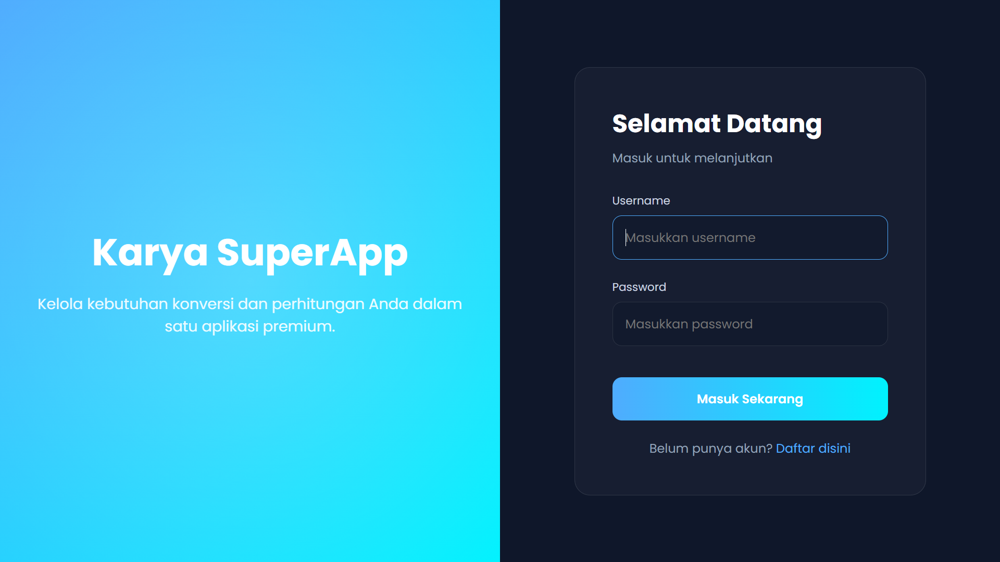

# Dokumentasi Project - Calcon

**Nama:** Raffelino Hizkia Marbun | **Kelas:** II RKS A | **NPM:** 2423102065

## 1. Deskripsi
**Calcon** adalah aplikasi web multifungsi (SuperApp) yang menggabungkan fitur kalkulator ilmiah dan konverter satuan profesional dalam satu platform. Aplikasi ini dirancang untuk memberikan kemudahan bagi pengguna dalam melakukan perhitungan matematis kompleks maupun konversi berbagai satuan internasional secara cepat, akurat, dan terintegrasi dengan sistem penyimpanan riwayat berbasis database.

## 2. User Story
Sebagai user, saya ingin:
* Mendaftar dan Login untuk menyimpan data riwayat perhitungan saya secara pribadi.
* Menggunakan kalkulator ilmiah untuk operasi matematika tingkat lanjut seperti trigonometri, logaritma, dan akar pangkat.
* Mengonversi berbagai kategori satuan (Panjang, Berat, Suhu, Waktu, Data, Kecepatan) secara instan.
* Melihat riwayat aktivitas perhitungan dan konversi yang telah dilakukan sebelumnya.

## 3. SRS (Software Requirements Specification)

### Feature List (Daftar Fitur)

1.  **Autentikasi Pengguna:**
    * Register akun baru.
    * Login session untuk keamanan data pengguna.
2.  **Kalkulator Ilmiah:**
    * Operasi aritmatika dasar dan fungsi ilmiah (sin, cos, tan, log, ln).
    * Fitur Memory (MC, MR, M+, M-) dan mode perhitungan (DEG/RAD).
    * Fitur tombol sekunder (2nd) untuk fungsi invers.
3.  **Konverter Satuan Pro:**
    * 6 Kategori Utama: Panjang, Berat, Suhu, Waktu, Data Digital, dan Kecepatan.
    * Konversi real-time saat pengguna memasukkan nilai angka.
4.  **Data Management:**
    * Penyimpanan riwayat operasi secara otomatis menggunakan AJAX ke database MySQL.
    * Visualisasi tabel riwayat aktivitas pada dashboard pengguna.

## 4. UML Diagram

### a. Use Case Diagram
Diagram ini menggambarkan interaksi pengguna dengan sistem Calcon, mulai dari proses autentikasi hingga penggunaan fitur utama kalkulator dan konverter yang datanya tersimpan ke dalam sistem.

 

### b. Activity Diagram
Menggambarkan alur aktivitas saat pengguna melakukan perhitungan: dimulai dari pengecekan login, penginputan data pada kalkulator/konverter, proses validasi logika oleh sistem, hingga penyimpanan otomatis ke database riwayat.

### c. Sequence Diagram
Menjelaskan urutan pertukaran pesan antara komponen **User**, **Web Interface** (JavaScript), dan **Server** (PHP/MySQL) saat pengguna menekan tombol hitung untuk menyimpan data secara asinkron (AJAX).

## 5. Mock-Up

Tampilan antarmuka (UI) pada aplikasi **Calcon (Karya SuperApp)** dirancang dengan tema *Dark Elegant* menggunakan kombinasi warna Slate dan gradasi biru-cyan untuk memberikan kesan profesional dan modern.

### a. Tampilan Login & Register
Halaman autentikasi menggunakan tata letak *split-screen*. Sisi kiri menampilkan branding visual dengan gradasi linear, sementara sisi kanan berisi kartu login/register yang bersih dengan input field yang responsif.

### b. Tampilan Dashboard (Kalkulator Ilmiah)
Panel utama kalkulator menampilkan *display* digital yang besar di bagian atas, diikuti oleh baris kontrol memori dan mode (DEG/RAD). *Grid* tombol diatur secara presisi untuk memisahkan fungsi matematika dasar, fungsi ilmiah, dan operator.

### c. Tampilan Unit Converter
Antarmuka konverter menggunakan sistem kartu ganda (Input & Result) dengan ikon *swap* di tengahnya. Terdapat selektor kategori di bagian atas yang memungkinkan pengguna berpindah antar satuan (Panjang, Suhu, Kecepatan, dll) dengan transisi yang halus.

### d. Tampilan Riwayat Aktivitas
Tabel riwayat terletak di bagian bawah dashboard, menampilkan daftar kronologis aktivitas pengguna. Setiap baris mencatat operasi matematika atau hasil konversi beserta *timestamp* waktu yang diambil langsung dari database.

