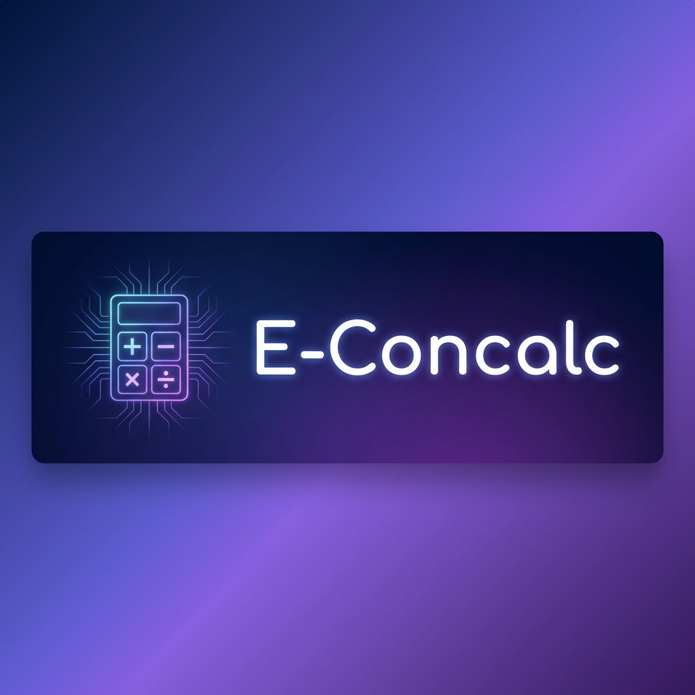

# 📚 Dokumentasi Project (Progress Report)

<p align="center">
  
</p>

## E-Concalc - Electronic Calculation Platform


---

## 📖 Deskripsi
**E-Concalc** (Electronic Conversion Calculator) adalah platform kalkulator berbasis web yang modern dan komprehensif. Aplikasi ini dirancang untuk memenuhi berbagai kebutuhan perhitungan pengguna dalam satu tempat, mulai dari perhitungan matematis kompleks, konversi satuan, estimasi perencanaan finansial, hingga pemantauan kesehatan tubuh.

Dengan antarmuka **Dark Mode** yang premium dan responsif, E-Concalc memberikan pengalaman pengguna yang nyaman dan efisien di berbagai perangkat.

### Tujuan Utama:
-   **All-in-One Tool**: Menggabungkan berbagai alat hitung (Kalkulator, Konverter, Finansial, Kesehatan) dalam satu aplikasi.
-   **User Experience Premium**: Menyajikan antarmuka modern, cepat, dan mudah digunakan (User Friendly).
-   **Produktivitas**: Membantu pengguna melakukan perhitungan sehari-hari dengan cepat dan akurat.
-   **Pencatatan Riwayat**: Menyimpan log aktivitas perhitungan untuk referensi di masa mendatang.

### Tech Stack:
-   **Backend:** Laravel 10 (PHP)
-   **Frontend:** Blade Templates, Vanilla CSS (Modern UI), Vanilla JS
-   **Database:** MySQL
-   **Server:** Apache (XAMPP) / Nginx

---

## 📋 User Story

| ID | User Story | Priority |
|----|------------|----------|
| US-01 | Sebagai user, saya ingin melakukan perhitungan matematika ilmiah (sin, cos, tan, log) | High |
| US-02 | Sebagai user, saya ingin mengonversi berbagai satuan (panjang, berat, suhu) dengan mudah | High |
| US-03 | Sebagai user, saya ingin menghitung bunga tabungan atau cicilan pinjaman untuk perencanaan uang | High |
| US-04 | Sebagai user, saya ingin mengetahui BMI dan berat badan ideal saya untuk memantau kesehatan | Medium |
| US-05 | Sebagai user, saya ingin melihat riwayat perhitungan yang pernah saya lakukan | Medium |
| US-06 | Sebagai user, saya ingin mengubah mata uang asing ke Rupiah secara real-time | Medium |
| US-07 | Sebagai user, saya ingin menyimpan rencana finansial saya agar tidak lupa | Low |

---

## 📝 SRS - Feature List

### Functional Requirements
| ID | Feature | Deskripsi | Status |
|----|---------|-----------|--------|
| FR-01 | Authentication | Login, Register, Logout System | ✅ Done |
| FR-02 | Scientific Calc | Kalkulator dengan fungsi trigonometri, logaritma, eksponen, dll | ✅ Done |
| FR-03 | Unit Converter | Konversi Panjang, Berat, Suhu, Waktu, Data, dll | ✅ Done |
| FR-04 | Currency Converter | Konversi mata uang asing (USD, EUR, dll) ke IDR | ✅ Done |
| FR-05 | Financial Calc | Hitung Bunga Sederhana/Majemuk, Cicilan Pinjaman, Diskon | ✅ Done |
| FR-06 | Health Calc | Hitung BMI (Body Mass Index) & Berat Badan Ideal | ✅ Done |
| FR-07 | History Log | Mencatat riwayat aktivitas perhitungan user | ✅ Done |
| FR-08 | Dark Mode | Tampilan antarmuka gelap yang nyaman di mata | ✅ Done |
| FR-09 | Responsive UI | Tampilan adaptif untuk Desktop, Tablet, dan Mobile | ✅ Done |

### Non-Functional Requirements
| ID | Requirement | Deskripsi |
|----|-------------|-----------|
| NFR-01 | Aesthetics | Desain modern dengan efek glassmorphism dan neon |
| NFR-02 | Performance | Waktu muat halaman yang cepat dan ringan |
| NFR-03 | Compatibility | Berjalan lancar di browser modern (Chrome, Edge, Firefox) |
| NFR-04 | Usability | Navigasi intuitif antar fitur |

---

## 🎨 Mock-Up / Screenshots

### 1. Halaman Login


### 2. Scientific Calculator


### 3. Unit Converter


### 4. Currency Converter


### 5. Financial Calculator


### 6. Health Calculator


---

## 🚀 Instalasi

### Prerequisites
Pastikan Anda sudah menginstall:
-   **PHP** >= 8.1
-   **Composer**
-   **Node.js** & **NPM**
-   **MySQL** (via XAMPP/Laragon)
-   **Git**

### Langkah 1: Clone Repository
```bash
git clone https://github.com/falcon-ioi/Caclcon.git
cd Caclcon
```

### Langkah 2: Install Dependencies
```bash
# Install PHP dependencies
composer install

# Install Assets dependencies
npm install
```

### Langkah 3: Konfigurasi Environment
```bash
# Copy file environment
cp .env.example .env

# Generate application key
php artisan key:generate
```

**Edit file `.env`** dan sesuaikan konfigurasi database Anda:

```env
DB_CONNECTION=mysql
DB_HOST=127.0.0.1
DB_PORT=3306
DB_DATABASE=ecalc_db  # Sesuaikan dengan nama DB Anda
DB_USERNAME=root
DB_PASSWORD=
```

### Langkah 4: Setup Database
```bash
# Jalankan migrasi tabel
php artisan migrate
```

### Langkah 5: Jalankan Server
```bash
php artisan serve
```

Aplikasi akan berjalan di: **http://localhost:8000**

### 🔐 Default Account
Silakan **Register** akun baru pada halaman login untuk mulai menggunakan aplikasi sepenuhnya.

---

## 📁 Struktur Database

Aplikasi E-Concalc menggunakan beberapa tabel utama:
-   `users`: Menyimpan data pengguna.
-   `financial_plans`: Menyimpan data rencana keuangan yang disimpan user.
-   `health_logs`: Menyimpan riwayat perhitungan BMI/Kesehatan.
-   `riwayat_aktivitas` (optional): Log aktivitas umum.

---

## � License
This project is open-sourced software licensed under the [MIT license](https://opensource.org/licenses/MIT).

## 👨‍💻 Author
**Falcon IOI**
-   GitHub: [falcon-ioi](https://github.com/falcon-ioi)
