# 📚 Dokumentasi Project (Progress Report)

## E-Concalc - Electronic Conversion Calculator


---

## 📖 Deskripsi
**E-Concalc** (Electronic Conversion Calculator) adalah platform kalkulator berbasis web yang modern dan komprehensif. Aplikasi ini dirancang untuk memenuhi berbagai kebutuhan perhitungan pengguna dalam satu tempat, mulai dari perhitungan matematis kompleks, konversi satuan, estimasi perencanaan finansial, hingga pemantauan kesehatan tubuh.

Dengan antarmuka **Dark Mode** yang premium dan responsif, E-Concalc memberikan pengalaman pengguna yang nyaman dan efisien di berbagai perangkat, serta mendukung sistem login hibrida (Guest & Google OAuth).

### Tujuan Utama:
- **All-in-One Tool**: Menggabungkan berbagai alat hitung (Kalkulator, Konverter, Finansial, Kesehatan) dalam satu aplikasi
- **User Experience Premium**: Menyajikan antarmuka modern dengan efek glassmorphism dan neon glow
- **Produktivitas**: Membantu pengguna melakukan perhitungan sehari-hari dengan cepat dan akurat
- **Pencatatan Riwayat**: Menyimpan log aktivitas perhitungan untuk referensi di masa mendatang
- **Aksesibilitas Tinggi**: Akses instan bagi pengguna tamu tanpa perlu registrasi

### Tech Stack:
- **Backend:** Laravel 10 (PHP 8.1+)
- **Frontend:** Blade Templates + Vanilla JavaScript
- **Styling:** Vanilla CSS (Modern Dark UI)
- **Database:** MySQL 8.0
- **Auth:** Google OAuth (Laravel Socialite) + Custom Guard
- **Server:** Apache (XAMPP)

---

## 📋 User Story

| ID | User Story | Priority |
|----|------------|----------|
| US-01 | Sebagai user, saya ingin melakukan perhitungan matematika ilmiah (sin, cos, tan, log) | High |
| US-02 | Sebagai user, saya ingin masuk menggunakan akun Google agar lebih cepat | High |
| US-03 | Sebagai user, saya ingin mengonversi berbagai satuan (panjang, berat, suhu, dll) | High |
| US-04 | Sebagai user, saya ingin menghitung bunga tabungan atau cicilan pinjaman | High |
| US-05 | Sebagai user, saya ingin mengetahui BMI dan berat badan ideal saya | Medium |
| US-06 | Sebagai user, saya ingin melihat riwayat perhitungan yang pernah saya lakukan | Medium |
| US-07 | Sebagai user, saya ingin menyimpan rencana finansial saya ke database | Medium |

---

## 📝 SRS - Feature List

### Functional Requirements
| ID | Feature | Deskripsi | Status |
|----|---------|-----------|--------|
| FR-01 | Authentication | Login Google via Socialite & Guest Access | ✅ Done |
| FR-02 | Scientific Calculator | Fungsi trigonometri, logaritma, eksponen, memory | ✅ Done |
| FR-03 | Unit Converter | Konversi 7+ Kategori (Panjang, Berat, Suhu, Data, dll) | ✅ Done |
| FR-04 | Currency Converter | Konversi mata uang asing real-time | ✅ Done |
| FR-05 | Financial Calculator | Hitung Bunga (Simple/Compound), Cicilan, Diskon | ✅ Done |
| FR-06 | Health Calculator | Hitung BMI & Berat Ideal (Devine Formula) | ✅ Done |
| FR-07 | History Log | Mencatat riwayat aktivitas perhitungan user | ✅ Done |
| FR-08 | Save Data | Menyimpan Rencana Finansial & Log Kesehatan | ✅ Done |
| FR-09 | Data Export | Ekspor riwayat ke format CSV/PDF | ✅ Done |

### Non-Functional Requirements
| ID | Requirement | Deskripsi |
|----|-------------|-----------|
| NFR-01 | Aesthetics | Desain modern dengan efek glassmorphism dan neon glow |
| NFR-02 | Performance | Waktu muat halaman yang cepat dan ringan (< 2 detik) |
| NFR-03 | Compatibility | Berjalan lancar di browser modern (Chrome, Edge, Firefox) |
| NFR-04 | Usability | Navigasi intuitif antar fitur dengan tab-based interface |
| NFR-05 | Security | Validasi input server-side & CSRF protection |

---

## UML Diagrams

### Use Case Diagram
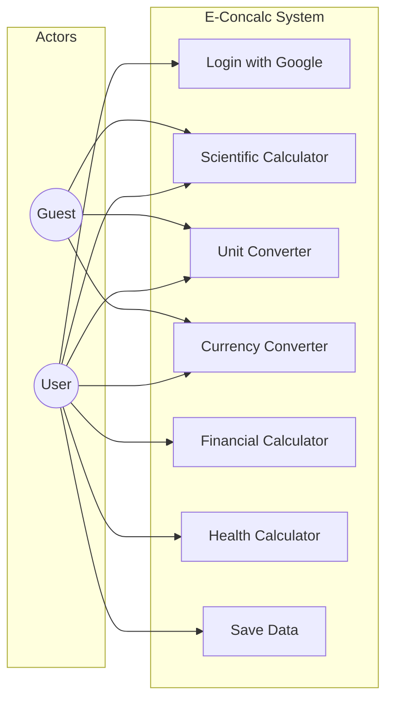
```mermaid
flowchart LR
    subgraph Actors
        User((User))
        Guest((Guest))
    end
    
    subgraph System[E-Concalc System]
        UC1[Login with Google]
        UC2[Scientific Calculator]
        UC3[Unit Converter]
        UC4[Currency Converter]
        UC5[Financial Calculator]
        UC6[Health Calculator]
        UC7[Save Data]
    end

    User --> UC1
    User --> UC2
    User --> UC3
    User --> UC4
    User --> UC5
    User --> UC6
    User --> UC7
    
    Guest --> UC2
    Guest --> UC3
    Guest --> UC4
```

### Activity Diagram - Main Application Flow
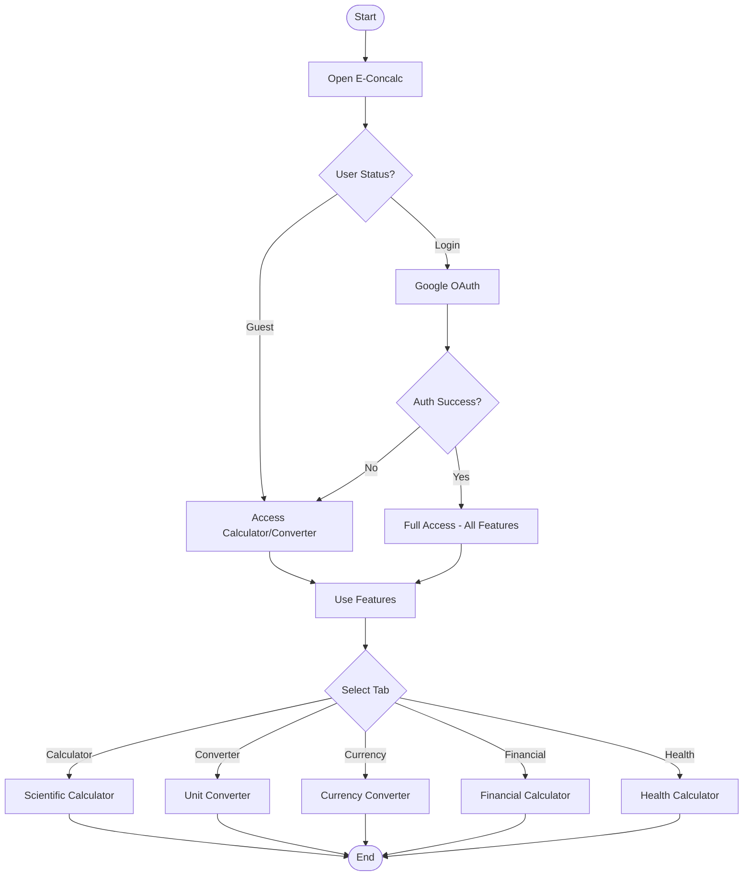
```mermaid
flowchart TD
    A([Start]) --> B[Open E-Concalc]
    B --> C{User Status?}
    
    C -->|Guest| D[Access Calculator/Converter]
    C -->|Login| E[Google OAuth]
    E --> F{Auth Success?}
    F -->|Yes| G[Full Access - All Features]
    F -->|No| D
    
    D --> H[Use Features]
    G --> H
    
    H --> I{Select Tab}
    I -->|Calculator| J[Scientific Calculator]
    I -->|Converter| K[Unit Converter]
    I -->|Currency| L[Currency Converter]
    I -->|Financial| M[Financial Calculator]
    I -->|Health| N[Health Calculator]
    
    J --> O([End])
    K --> O
    L --> O
    M --> O
    N --> O
```

### Activity Diagram - Scientific Calculator
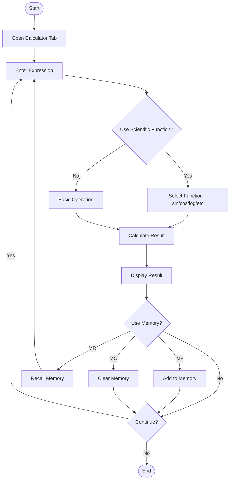
```mermaid
flowchart TD
    A([Start]) --> B[Open Calculator Tab]
    B --> C[Enter Expression]
    C --> D{Use Scientific Function?}
    
    D -->|Yes| E[Select Function - sin/cos/log/etc]
    D -->|No| F[Basic Operation]
    
    E --> G[Calculate Result]
    F --> G
    
    G --> H[Display Result]
    H --> I{Use Memory?}
    
    I -->|M+| J[Add to Memory]
    I -->|MR| K[Recall Memory]
    I -->|MC| L[Clear Memory]
    I -->|No| M{Continue?}
    
    J --> M
    K --> C
    L --> M
    
    M -->|Yes| C
    M -->|No| N([End])
```

### Activity Diagram - Unit Converter
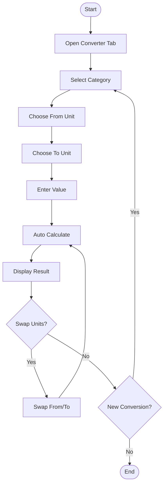
```mermaid
flowchart TD
    A([Start]) --> B[Open Converter Tab]
    B --> C[Select Category]
    C --> D[Choose From Unit]
    D --> E[Choose To Unit]
    E --> F[Enter Value]
    F --> G[Auto Calculate]
    G --> H[Display Result]
    H --> I{Swap Units?}
    
    I -->|Yes| J[Swap From/To]
    J --> G
    
    I -->|No| K{New Conversion?}
    K -->|Yes| C
    K -->|No| L([End])
```

### Activity Diagram - Currency Converter
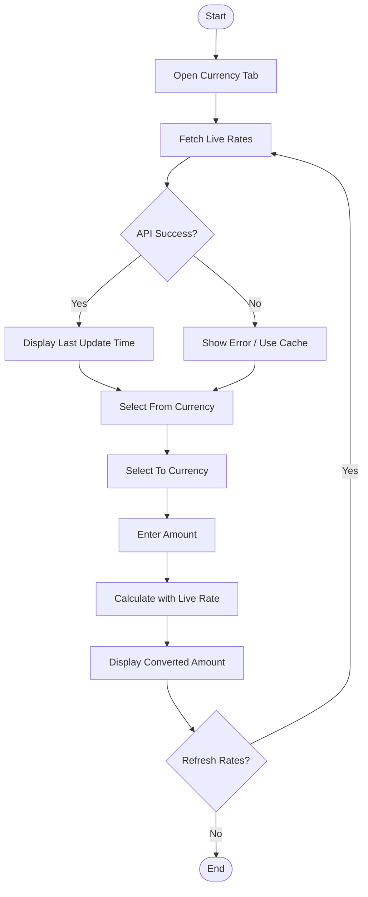
```mermaid
flowchart TD
    A([Start]) --> B[Open Currency Tab]
    B --> C[Fetch Live Rates]
    C --> D{API Success?}
    
    D -->|Yes| E[Display Last Update Time]
    D -->|No| F[Show Error / Use Cache]
    
    E --> G[Select From Currency]
    F --> G
    G --> H[Select To Currency]
    H --> I[Enter Amount]
    I --> J[Calculate with Live Rate]
    J --> K[Display Converted Amount]
    
    K --> L{Refresh Rates?}
    L -->|Yes| C
    L -->|No| M([End])
```

### Activity Diagram - Financial Calculator
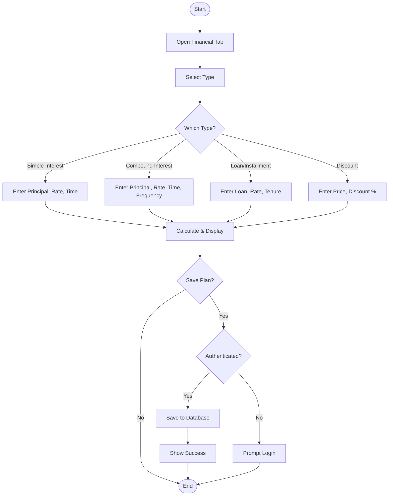
```mermaid
flowchart TD
    A([Start]) --> B[Open Financial Tab]
    B --> C[Select Type]
    C --> D{Which Type?}
    
    D -->|Simple Interest| E[Enter Principal, Rate, Time]
    D -->|Compound Interest| F[Enter Principal, Rate, Time, Frequency]
    D -->|Loan/Installment| G[Enter Loan, Rate, Tenure]
    D -->|Discount| H[Enter Price, Discount %]
    
    E --> I[Calculate & Display]
    F --> I
    G --> I
    H --> I
    
    I --> J{Save Plan?}
    J -->|Yes| K{Authenticated?}
    K -->|Yes| L[Save to Database]
    L --> M[Show Success]
    K -->|No| N[Prompt Login]
    
    J -->|No| O([End])
    M --> O
    N --> O
```

### Activity Diagram - Health Calculator
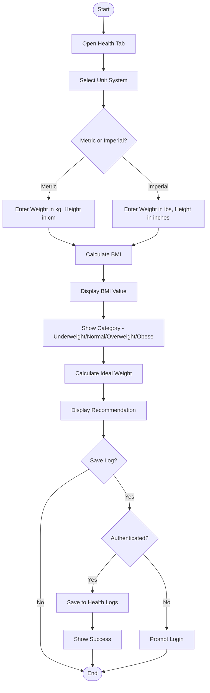
```mermaid
flowchart TD
    A([Start]) --> B[Open Health Tab]
    B --> C[Select Unit System]
    C --> D{Metric or Imperial?}
    
    D -->|Metric| E[Enter Weight in kg, Height in cm]
    D -->|Imperial| F[Enter Weight in lbs, Height in inches]
    
    E --> G[Calculate BMI]
    F --> G
    
    G --> H[Display BMI Value]
    H --> I[Show Category - Underweight/Normal/Overweight/Obese]
    I --> J[Calculate Ideal Weight]
    J --> K[Display Recommendation]
    
    K --> L{Save Log?}
    L -->|Yes| M{Authenticated?}
    M -->|Yes| N[Save to Health Logs]
    N --> O[Show Success]
    M -->|No| P[Prompt Login]
    
    L -->|No| Q([End])
    O --> Q
    P --> Q
```

### Sequence Diagram - Google OAuth Login
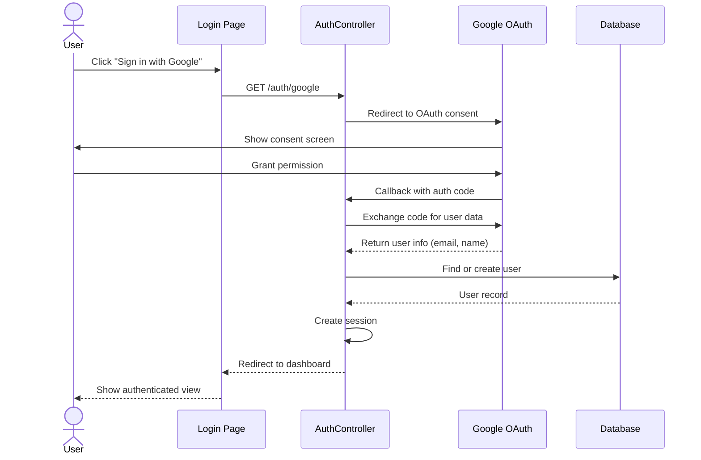
```mermaid
sequenceDiagram
    actor User
    participant UI as Login Page
    participant Auth as AuthController
    participant Google as Google OAuth
    participant DB as Database

    User->>UI: Click "Sign in with Google"
    UI->>Auth: GET /auth/google
    Auth->>Google: Redirect to OAuth consent
    Google->>User: Show consent screen
    User->>Google: Grant permission
    Google->>Auth: Callback with auth code
    Auth->>Google: Exchange code for user data
    Google-->>Auth: Return user info (email, name)
    Auth->>DB: Find or create user
    DB-->>Auth: User record
    Auth->>Auth: Create session
    Auth-->>UI: Redirect to dashboard
    UI-->>User: Show authenticated view
```

### Sequence Diagram - Save Financial Plan
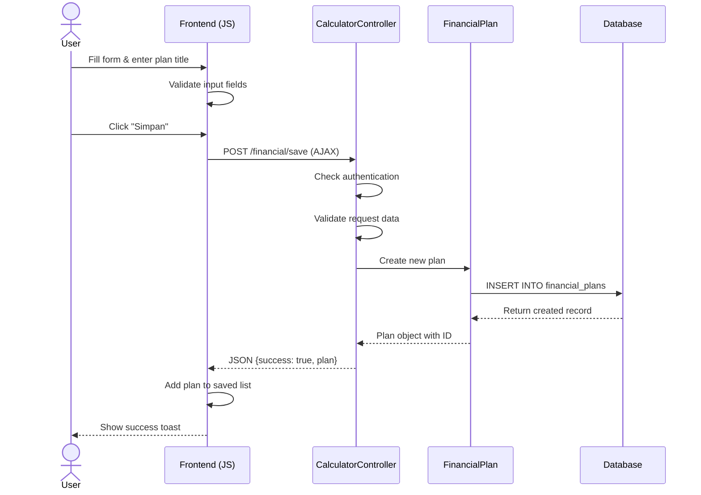
```mermaid
sequenceDiagram
    actor User
    participant UI as Frontend (JS)
    participant API as CalculatorController
    participant Model as FinancialPlan
    participant DB as Database

    User->>UI: Fill form & enter plan title
    UI->>UI: Validate input fields
    User->>UI: Click "Simpan"
    UI->>API: POST /financial/save (AJAX)
    API->>API: Check authentication
    API->>API: Validate request data
    API->>Model: Create new plan
    Model->>DB: INSERT INTO financial_plans
    DB-->>Model: Return created record
    Model-->>API: Plan object with ID
    API-->>UI: JSON {success: true, plan}
    UI->>UI: Add plan to saved list
    UI-->>User: Show success toast
```

### Sequence Diagram - Save Health Log
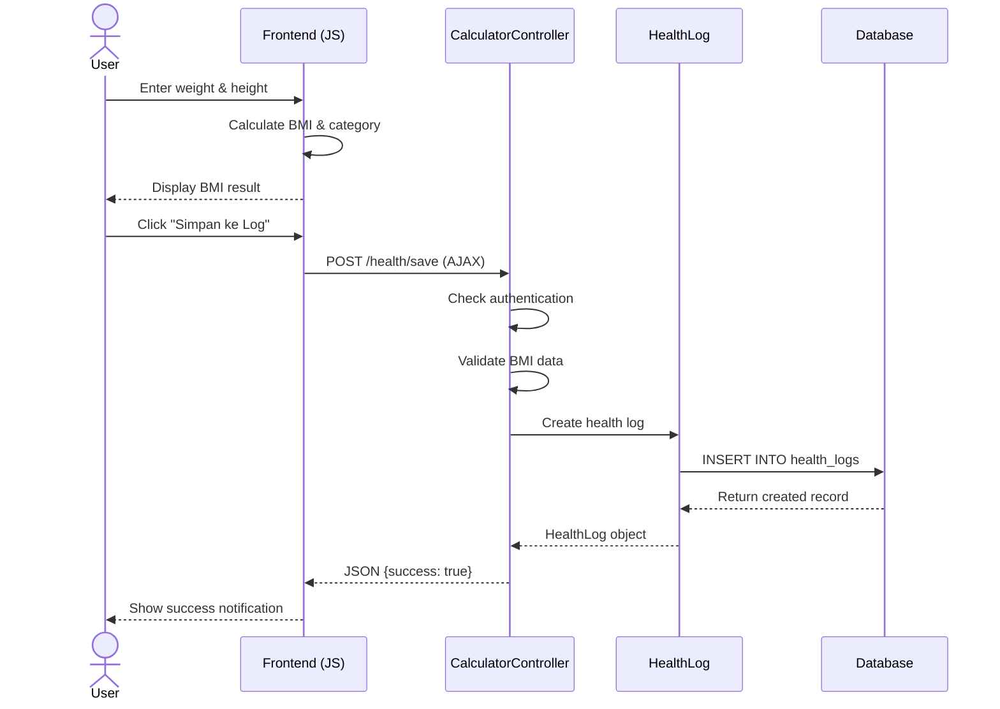
```mermaid
sequenceDiagram
    actor User
    participant UI as Frontend (JS)
    participant API as CalculatorController
    participant Model as HealthLog
    participant DB as Database

    User->>UI: Enter weight & height
    UI->>UI: Calculate BMI & category
    UI-->>User: Display BMI result
    User->>UI: Click "Simpan ke Log"
    UI->>API: POST /health/save (AJAX)
    API->>API: Check authentication
    API->>API: Validate BMI data
    API->>Model: Create health log
    Model->>DB: INSERT INTO health_logs
    DB-->>Model: Return created record
    Model-->>API: HealthLog object
    API-->>UI: JSON {success: true}
    UI-->>User: Show success notification
```

### ERD (Entity Relationship Diagram)
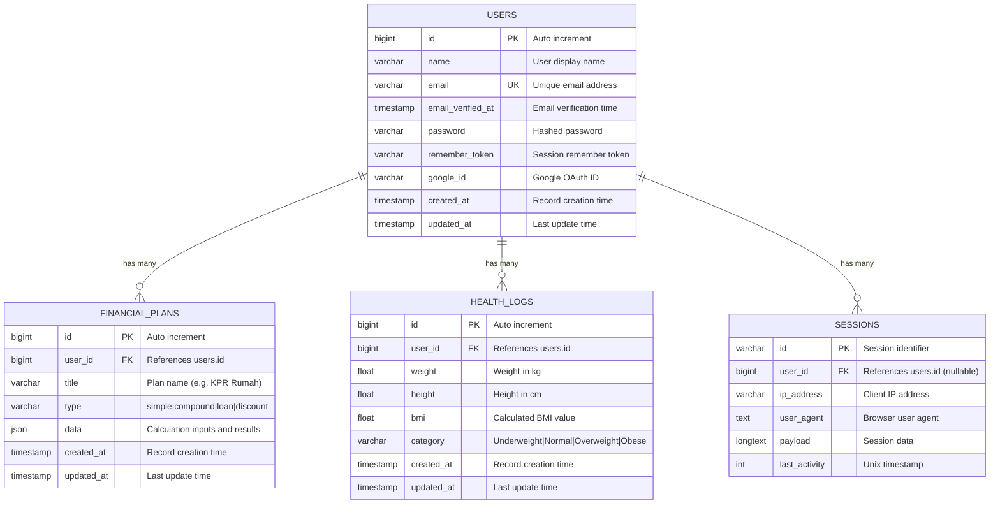
```mermaid
erDiagram
    USERS ||--o{ FINANCIAL_PLANS : "has many"
    USERS ||--o{ HEALTH_LOGS : "has many"
    USERS ||--o{ SESSIONS : "has many"
    
    USERS {
        bigint id PK "Auto increment"
        varchar name "User display name"
        varchar email UK "Unique email address"
        timestamp email_verified_at "Email verification time"
        varchar password "Hashed password"
        varchar remember_token "Session remember token"
        varchar google_id "Google OAuth ID"
        timestamp created_at "Record creation time"
        timestamp updated_at "Last update time"
    }
    
    FINANCIAL_PLANS {
        bigint id PK "Auto increment"
        bigint user_id FK "References users.id"
        varchar title "Plan name (e.g. KPR Rumah)"
        varchar type "simple|compound|loan|discount"
        json data "Calculation inputs and results"
        timestamp created_at "Record creation time"
        timestamp updated_at "Last update time"
    }
    
    HEALTH_LOGS {
        bigint id PK "Auto increment"
        bigint user_id FK "References users.id"
        float weight "Weight in kg"
        float height "Height in cm"
        float bmi "Calculated BMI value"
        varchar category "Underweight|Normal|Overweight|Obese"
        timestamp created_at "Record creation time"
        timestamp updated_at "Last update time"
    }
    
    SESSIONS {
        varchar id PK "Session identifier"
        bigint user_id FK "References users.id (nullable)"
        varchar ip_address "Client IP address"
        text user_agent "Browser user agent"
        longtext payload "Session data"
        int last_activity "Unix timestamp"
    }
```

---

## 🎨 Mock-Up / Screenshots

### 1. Halaman Login
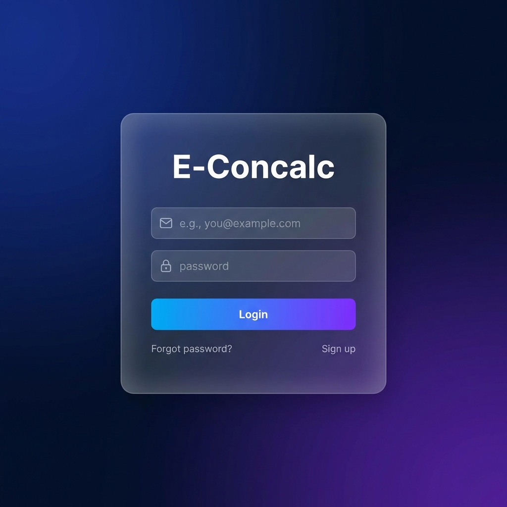

### 2. Scientific Calculator
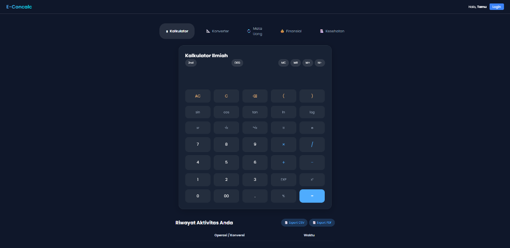

### 3. Unit Converter
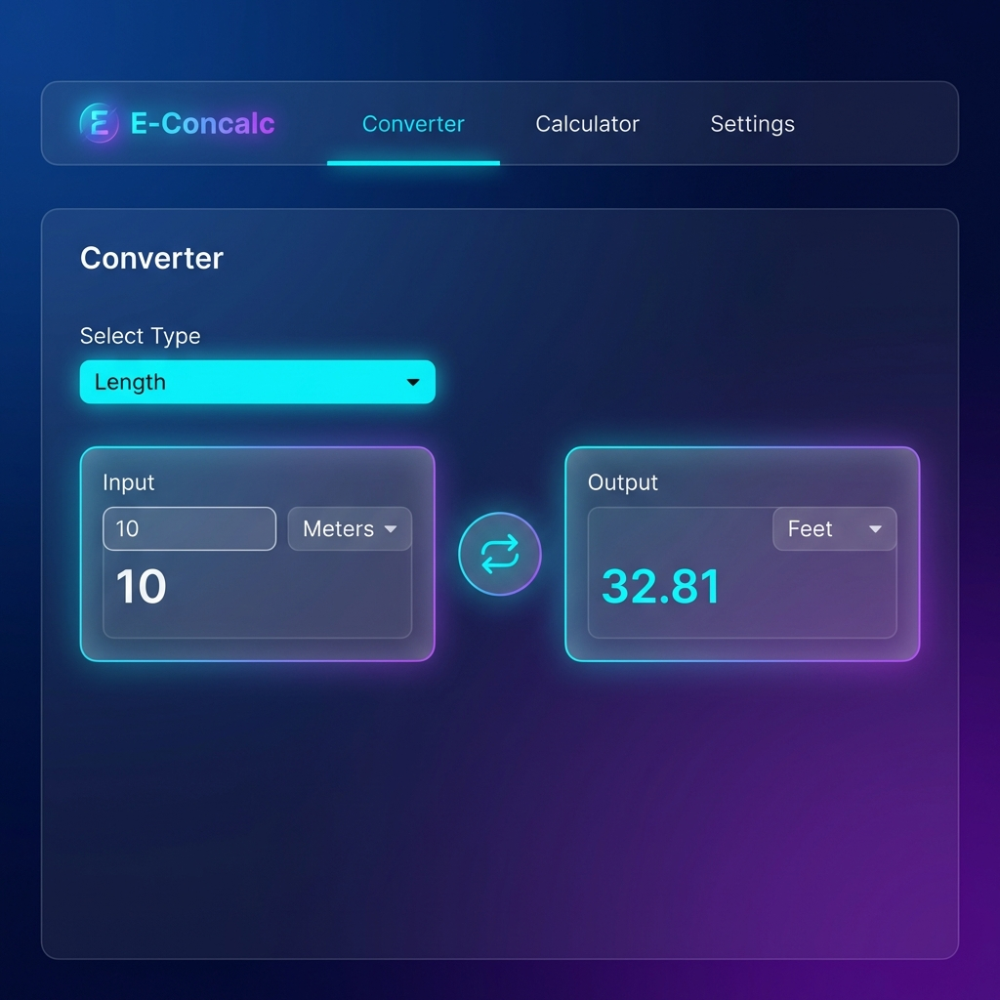

### 4. Currency Converter
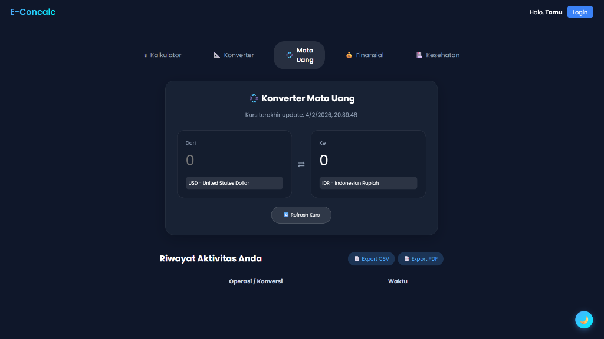

### 5. Financial Calculator
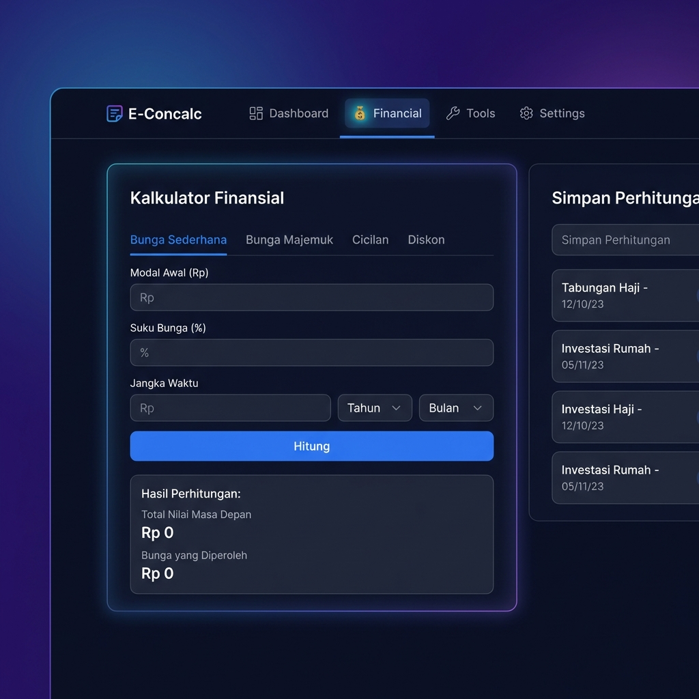

### 6. Health Calculator
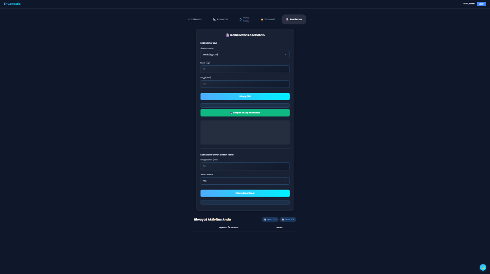

---

## 🔄 SDLC (Software Development Life Cycle)

**Metodologi:** Agile - Iterative Development

| Phase | Aktivitas | Output |
|-------|-----------|--------|
| **1. Planning** | Requirement gathering, user story | PRD, User Stories |
| **2. Analysis** | SRS, feature prioritization | Feature List, SRS Doc |
| **3. Design** | UML diagrams, database design, mockups | UML, ERD, Mockups |
| **4. Development** | Coding, unit testing | Source code, tests |
| **5. Testing** | Integration testing, UAT | Test cases, bug reports |
| **6. Deployment** | Server setup, deployment | Live application |

### Timeline
```
Minggu 1     : Planning & Analysis
Minggu 2     : Design (UML, Mockups, Database)
Minggu 3-5   : Development Sprint 1 (Core Features - Calculator, Converter)
Minggu 6-7   : Development Sprint 2 (Financial, Health, Google Auth)
Minggu 8     : Testing, Bug Fixes & Deployment
```

---

## 🚀 Instalasi

### Prerequisites
Pastikan Anda sudah menginstall:
- **PHP** >= 8.1
- **Composer** >= 2.0
- **Node.js** >= 18.0
- **MySQL** (via XAMPP/Laragon)
- **Git**

### Langkah 1: Clone Repository
```bash
git clone https://github.com/falcon-ioi/Caclcon.git
cd Caclcon
```

### Langkah 2: Install Dependencies
```bash
# Install PHP dependencies
composer install

# Install Node.js dependencies
npm install
```

### Langkah 3: Konfigurasi Environment & Google OAuth
```bash
# Copy file environment
cp .env.example .env

# Generate application key
php artisan key:generate
```

**Edit file `.env`** dan sesuaikan:

```env
DB_CONNECTION=mysql
DB_HOST=127.0.0.1
DB_DATABASE=ecalc_db
DB_USERNAME=root
DB_PASSWORD=

# Google OAuth (Wajib untuk Login)
GOOGLE_CLIENT_ID=your_google_client_id
GOOGLE_CLIENT_SECRET=your_google_client_secret
GOOGLE_REDIRECT_URI=http://localhost:8000/auth/google/callback
```

### Langkah 4: Setup Database
```bash
# Jalankan migrasi tabel
php artisan migrate
```

### Langkah 5: Build & Run
```bash
# Build assets
npm run build

# Jalankan server
php artisan serve
```

Aplikasi akan berjalan di: **http://localhost:8000**

### 🔐 Akun & Login
- **Guest Mode**: Langsung akses fitur Kalkulator & Konverter tanpa login.
- **Full Access**: Gunakan tombol "Sign in with Google" untuk fitur Simpan & Riwayat.

---

## 📁 Struktur Database
```
users              → User accounts (id, name, email, google_id)
financial_plans    → Data perencanaan finansial (user_id, title, type, data json)
health_logs        → Pencatatan BMI & kesehatan (user_id, bmi, weight, height)
riwayat_aktivitas  → Log history perhitungan umum
```

---

## 📁 Struktur Folder
```
ECalc/
├── app/
│   ├── Http/Controllers/   → Auth, Calculator, Financial logic
│   └── Models/             → Eloquent Models (User, FinancialPlan)
├── database/migrations/    → Schema definitions
├── public/                 → Compiled assets & Images
├── resources/views/        → Blade templates (UI)
└── routes/web.php          → Route definitions
```

---

## 🌟 Fitur Unggulan

| Fitur | Deskripsi |
|-------|-----------|
| 🔢 **Scientific Calculator** | Trigonometri, Eksponen, Memory Functions |
| 📐 **Multi-Unit Converter** | 7 Kategori Konversi Satuan |
| 💵 **Real-time Currency** | Kurs Mata Uang Asing Live |
| 💰 **Financial Tools** | Bunga Sederhana, Majemuk, Cicilan, Diskon |
| ❤️ **Health Tracker** | BMI Calculator & Ideal Weight |
| 🔐 **Hybrid Auth** | Login Google + Akses Tamu |

---

## 📜 License
This project is open-sourced software licensed under the [MIT license](https://opensource.org/licenses/MIT).

---

## 👨‍💻 Author
**Falcon IOI**
- GitHub: [falcon-ioi](https://github.com/falcon-ioi)

---

⭐ **Star this repo if you find it useful!**
