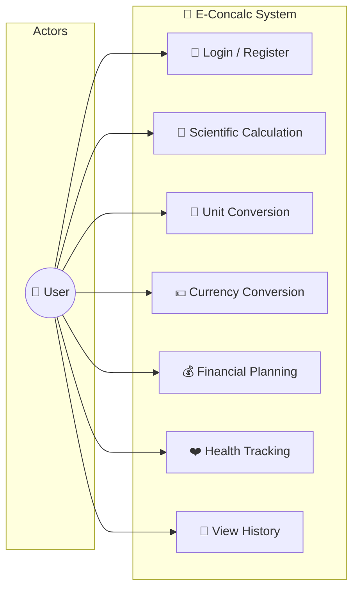
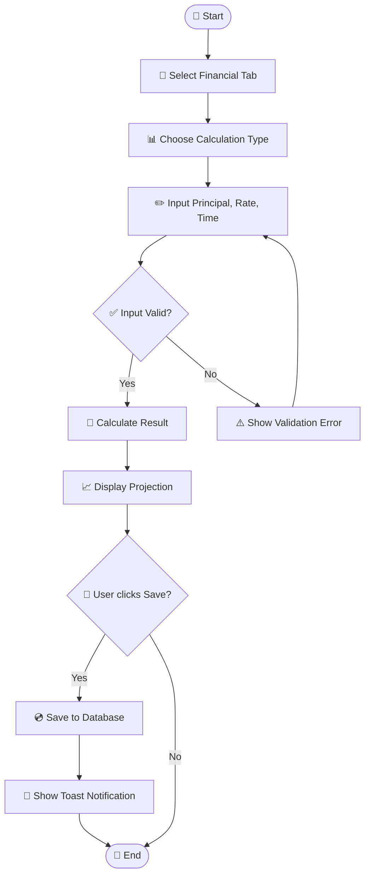
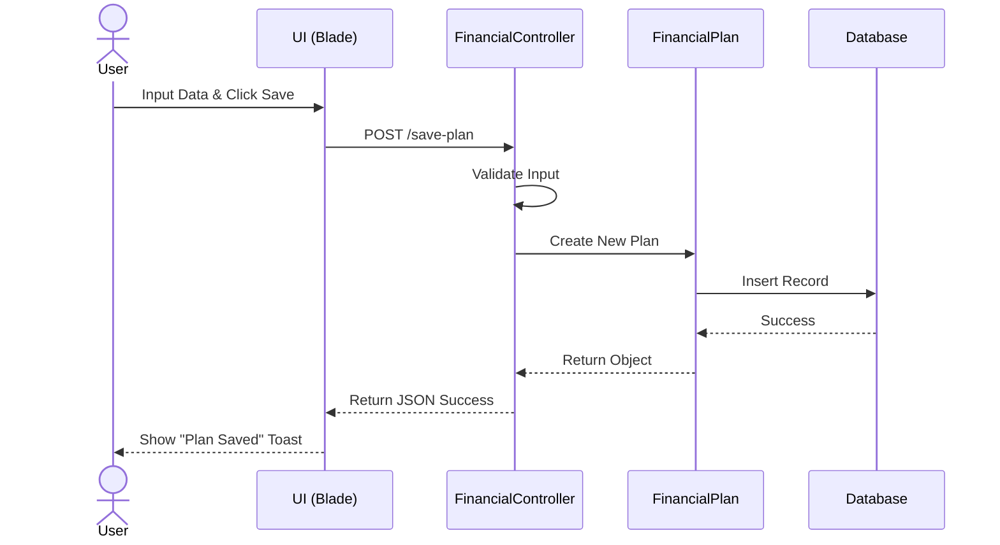
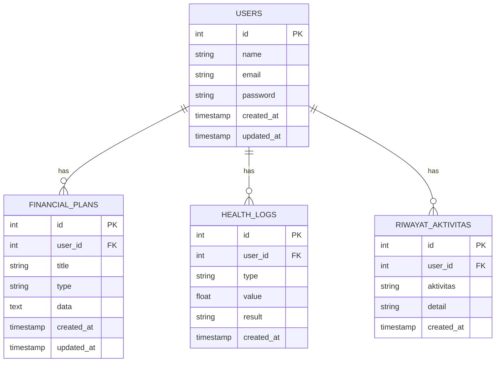

# 📚 Dokumentasi Project (Progress Report)

<p align="center">
  
</p>

## E-Concalc - Electronic Calculation Platform


---

## 📖 Deskripsi
**E-Concalc** (Electronic Conversion Calculator) adalah platform kalkulator berbasis web yang modern dan komprehensif. Aplikasi ini dirancang untuk memenuhi berbagai kebutuhan perhitungan pengguna dalam satu tempat, mulai dari perhitungan matematis kompleks, konversi satuan, estimasi perencanaan finansial, hingga pemantauan kesehatan tubuh.

Dengan antarmuka **Dark Mode** yang premium dan responsif, E-Concalc memberikan pengalaman pengguna yang nyaman dan efisien di berbagai perangkat.

### Tujuan Utama:
- **All-in-One Tool**: Menggabungkan berbagai alat hitung (Kalkulator, Konverter, Finansial, Kesehatan) dalam satu aplikasi
- **User Experience Premium**: Menyajikan antarmuka modern dengan efek glassmorphism dan neon glow
- **Produktivitas**: Membantu pengguna melakukan perhitungan sehari-hari dengan cepat dan akurat
- **Pencatatan Riwayat**: Menyimpan log aktivitas perhitungan untuk referensi di masa mendatang

### Tech Stack:
- **Backend:** Laravel 10 (PHP 8.1+)
- **Frontend:** Blade Templates + Vanilla JavaScript
- **Styling:** Vanilla CSS (Modern Dark UI)
- **Database:** MySQL
- **Server:** Apache (XAMPP) / Nginx

---

## 📋 User Story

| ID | User Story | Priority |
|----|------------|----------|
| US-01 | Sebagai user, saya ingin melakukan perhitungan matematika ilmiah (sin, cos, tan, log) | High |
| US-02 | Sebagai user, saya ingin mengonversi berbagai satuan (panjang, berat, suhu) dengan mudah | High |
| US-03 | Sebagai user, saya ingin menghitung bunga tabungan atau cicilan pinjaman untuk perencanaan uang | High |
| US-04 | Sebagai user, saya ingin mengetahui BMI dan berat badan ideal saya untuk memantau kesehatan | Medium |
| US-05 | Sebagai user, saya ingin melihat riwayat perhitungan yang pernah saya lakukan | Medium |
| US-06 | Sebagai user, saya ingin mengubah mata uang asing ke Rupiah secara real-time | Medium |
| US-07 | Sebagai user, saya ingin menyimpan rencana finansial saya agar tidak lupa | Low |

---

## 📝 SRS - Feature List

### Functional Requirements
| ID | Feature | Deskripsi | Status |
|----|---------|-----------|--------|
| FR-01 | Authentication | Login, Register, Logout System dengan Laravel | ✅ Done |
| FR-02 | Scientific Calculator | Kalkulator dengan fungsi trigonometri, logaritma, eksponen, dll | ✅ Done |
| FR-03 | Unit Converter | Konversi Panjang, Berat, Suhu, Waktu, Data, Luas, Volume | ✅ Done |
| FR-04 | Currency Converter | Konversi mata uang asing (USD, EUR, dll) ke IDR real-time | ✅ Done |
| FR-05 | Financial Calculator | Hitung Bunga Sederhana/Majemuk, Cicilan Pinjaman, Diskon | ✅ Done |
| FR-06 | Health Calculator | Hitung BMI (Body Mass Index) & Berat Badan Ideal | ✅ Done |
| FR-07 | History Log | Mencatat riwayat aktivitas perhitungan user | ✅ Done |
| FR-08 | Save Financial Plans | Menyimpan rencana keuangan ke database | ✅ Done |
| FR-09 | Dark Mode UI | Tampilan antarmuka gelap premium yang nyaman di mata | ✅ Done |
| FR-10 | Responsive Design | Tampilan adaptif untuk Desktop, Tablet, dan Mobile | ✅ Done |

### Non-Functional Requirements
| ID | Requirement | Deskripsi |
|----|-------------|-----------|
| NFR-01 | Aesthetics | Desain modern dengan efek glassmorphism dan neon glow |
| NFR-02 | Performance | Waktu muat halaman yang cepat dan ringan (< 3 detik) |
| NFR-03 | Compatibility | Berjalan lancar di browser modern (Chrome, Edge, Firefox) |
| NFR-04 | Usability | Navigasi intuitif antar fitur dengan tab-based interface |
| NFR-05 | Security | Input validation dan sanitization untuk semua form |

---

## 📊 UML Diagrams

### Use Case Diagram

```mermaid
flowchart LR
    subgraph Actors
        User(("👤 User"))
    end
    
    subgraph E-Concalc["📱 E-Concalc System"]
        UC1["🔐 Login / Register"]
        UC2["🔢 Scientific Calculation"]
        UC3["📐 Unit Conversion"]
        UC4["💵 Currency Conversion"]
        UC5["💰 Financial Planning"]
        UC6["❤️ Health Tracking"]
        UC7["📜 View History"]
    end

    User --> UC1
    User --> UC2
    User --> UC3
    User --> UC4
    User --> UC5
    User --> UC6
    User --> UC7
```

### Activity Diagram - Financial Planning

```mermaid
flowchart TD
    A(["🚀 Start"]) --> B["📂 Select Financial Tab"]
    B --> C["📊 Choose Calculation Type"]
    C --> D["✏️ Input Principal, Rate, Time"]
    D --> E{"✅ Input Valid?"}
    
    E -->|Yes| F["🔢 Calculate Result"]
    F --> G["📈 Display Projection"]
    G --> H{"💾 User clicks Save?"}
    
    H -->|Yes| I["💿 Save to Database"]
    I --> J["🔔 Show Toast Notification"]
    J --> K(["🏁 End"])
    
    H -->|No| K
    E -->|No| L["⚠️ Show Validation Error"]
    L --> D
```

### Sequence Diagram - Save Financial Plan

```mermaid
sequenceDiagram
    actor User
    participant View as UI (Blade)
    participant Controller as FinancialController
    participant Model as FinancialPlan
    participant DB as Database

    User->>View: Input Data & Click Save
    View->>Controller: POST /save-plan
    Controller->>Controller: Validate Input
    Controller->>Model: Create New Plan
    Model->>DB: Insert Record
    DB-->>Model: Success
    Model-->>Controller: Return Object
    Controller-->>View: Return JSON Success
    View-->>User: Show "Plan Saved" Toast
```

### ERD (Entity Relationship Diagram)

```mermaid
erDiagram
    USERS ||--o{ FINANCIAL_PLANS : has
    USERS ||--o{ HEALTH_LOGS : has
    USERS ||--o{ RIWAYAT_AKTIVITAS : has
    
    USERS {
        int id PK
        string name
        string email
        string password
        timestamp created_at
        timestamp updated_at
    }
    
    FINANCIAL_PLANS {
        int id PK
        int user_id FK
        string title
        string type
        text data
        timestamp created_at
        timestamp updated_at
    }
    
    HEALTH_LOGS {
        int id PK
        int user_id FK
        string type
        float value
        string result
        timestamp created_at
    }
    
    RIWAYAT_AKTIVITAS {
        int id PK
        int user_id FK
        string aktivitas
        string detail
        timestamp created_at
    }
```

---

## 🎨 Mock-Up / Screenshots

### 1. Halaman Login


### 2. Scientific Calculator


### 3. Unit Converter


### 4. Currency Converter


### 5. Financial Calculator


### 6. Health Calculator


---

## 🔄 SDLC (Software Development Life Cycle)

**Metodologi:** Agile - Iterative Development

| Phase | Aktivitas | Output |
|-------|-----------|--------|
| **1. Planning** | Requirement gathering, user story | PRD, User Stories |
| **2. Analysis** | SRS, feature prioritization | Feature List, SRS Doc |
| **3. Design** | UML diagrams, database design, mockups | UML, ERD, Mockups |
| **4. Development** | Coding, unit testing | Source code, tests |
| **5. Testing** | Integration testing, UAT | Test cases, bug reports |
| **6. Deployment** | Server setup, deployment | Live application |
| **7. Maintenance** | Bug fixes, feature updates | Patches, updates |

### Timeline
```
Minggu 1     : Planning & Analysis
Minggu 2     : Design (UML, Mockups, Database)
Minggu 3-5   : Development Sprint 1 (Core Features - Calculator, Converter)
Minggu 6-7   : Development Sprint 2 (Financial, Health, History)
Minggu 8     : Testing, Bug Fixes & Deployment
```

---

## 🚀 Instalasi

### Prerequisites
Pastikan Anda sudah menginstall:
- **PHP** >= 8.1
- **Composer** >= 2.0
- **Node.js** >= 18.0
- **NPM** >= 9.0
- **MySQL** (via XAMPP/Laragon)
- **Git**

### Langkah 1: Clone Repository
```bash
git clone https://github.com/falcon-ioi/Caclcon.git
cd Caclcon
```

### Langkah 2: Install Dependencies
```bash
# Install PHP dependencies
composer install

# Install Node.js dependencies
npm install
```

### Langkah 3: Konfigurasi Environment
```bash
# Copy file environment
cp .env.example .env

# Generate application key
php artisan key:generate
```

Edit file `.env` dan sesuaikan konfigurasi database:

```env
DB_CONNECTION=mysql
DB_HOST=127.0.0.1
DB_PORT=3306
DB_DATABASE=ecalc_db
DB_USERNAME=root
DB_PASSWORD=
```

### Langkah 4: Setup Database
```bash
# Buat database di MySQL
# mysql -u root -p
# CREATE DATABASE ecalc_db;

# Jalankan migrasi tabel
php artisan migrate

# (Optional) Link storage untuk upload file
php artisan storage:link
```

### Langkah 5: Build Assets
```bash
# Build untuk production
npm run build

# atau untuk development (dengan hot reload)
npm run dev
```

### Langkah 6: Jalankan Server
```bash
php artisan serve
```

Aplikasi akan berjalan di: **http://localhost:8000**

### 🔐 Default Account
Silakan **Register** akun baru pada halaman login untuk mulai menggunakan aplikasi sepenuhnya.

### ⚠️ Troubleshooting

| Error | Solusi |
|-------|--------|
| `SQLSTATE: no such table` | Jalankan `php artisan migrate:fresh` |
| `Vite manifest not found` | Jalankan `npm run build` |
| `Permission denied` | Jalankan `chmod -R 775 storage bootstrap/cache` |
| `Class not found` | Jalankan `composer dump-autoload` |
| `Page Expired (419)` | Clear cache: `php artisan config:clear` |

---

## 📁 Struktur Database

```
users              → User accounts (id, name, email, password)
financial_plans    → Saved financial calculations (user_id, title, type, data)
health_logs        → Health tracking history (user_id, type, value, result)
riwayat_aktivitas  → Activity history log (user_id, aktivitas, detail)
```

---

## 📂 Struktur Folder

```
ECalc/
├── app/
│   ├── Http/
│   │   ├── Controllers/
│   │   │   ├── AuthController.php
│   │   │   ├── CalculatorController.php
│   │   │   ├── ConverterController.php
│   │   │   ├── FinancialController.php
│   │   │   └── HealthController.php
│   │   └── Middleware/
│   └── Models/
│       ├── User.php
│       ├── FinancialPlan.php
│       └── HealthLog.php
├── database/
│   └── migrations/
├── public/
│   ├── css/
│   ├── js/
│   └── images/
├── resources/
│   └── views/
│       ├── auth/
│       │   ├── login.blade.php
│       │   └── register.blade.php
│       ├── main.blade.php
│       └── layouts/
├── routes/
│   └── web.php
└── .env
```

---

## 🌟 Fitur Unggulan

| Fitur | Deskripsi |
|-------|-----------|
| 🔢 **Scientific Calculator** | Mendukung operasi trigonometri (sin, cos, tan), logaritma, eksponen, faktorial, dan konstanta (π, e) |
| 📐 **Multi-Unit Converter** | Konversi 7 kategori: Panjang, Berat, Suhu, Waktu, Data, Luas, Volume |
| 💵 **Real-time Currency** | Kurs mata uang terupdate dengan API real-time |
| 💰 **Financial Tools** | Bunga sederhana, bunga majemuk, cicilan pinjaman, kalkulator diskon |
| ❤️ **Health Tracker** | Perhitungan BMI dengan interpretasi dan saran kesehatan |
| 📜 **History System** | Simpan dan lihat riwayat perhitungan |
| 🌙 **Dark Mode** | Tampilan gelap premium dengan efek glassmorphism |

---

## 📜 License
This project is open-sourced software licensed under the [MIT license](https://opensource.org/licenses/MIT).

---

## 👨‍💻 Author
**Falcon IOI**
- GitHub: [falcon-ioi](https://github.com/falcon-ioi)

---

⭐ **Star this repo if you find it useful!**
