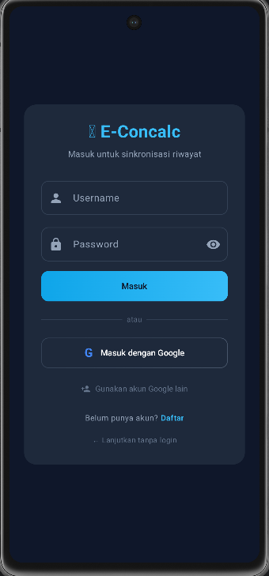
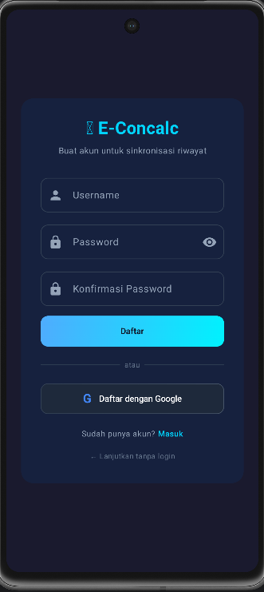
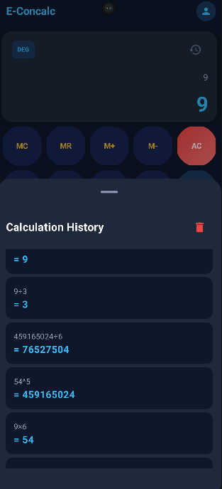

<p align="left">
  
  
</p>

# E-Concalc Mobile (Android Client)

Aplikasi klien *native* Android ini dirancang untuk menyediakan kalkulator ilmiah, konverter satuan & mata uang dengan efisiensi *resource* tinggi. Aplikasi ini mengimplementasikan sinkronisasi riwayat lintas platform dan manajemen autentikasi via Laravel Sanctum.

## 🏗️ Arsitektur: Jetpack Compose + REST Client

Sistem ini menggunakan arsitektur modern Android dengan **Jetpack Compose** untuk UI deklaratif dan **Retrofit** untuk komunikasi REST API.
- **UI Layer**: Jetpack Compose dengan Material Design 3 dan dark theme responsif.
- **Network Layer**: Retrofit 2 + OkHttp dengan interceptor otomatis untuk Bearer token.
- **Data Layer**: SharedPreferences per-user untuk penyimpanan lokal dan token management.

### Implementasi API Service (Kotlin)
Aplikasi menginisialisasi komunikasi REST melalui pola antarmuka Retrofit yang terstandarisasi.

```kotlin
interface ApiService {
    @POST("api/login")
    suspend fun login(@Body request: LoginRequest): Response<AuthResponse>

    @POST("api/register")
    suspend fun register(@Body request: RegisterRequest): Response<AuthResponse>

    @POST("api/login/google")
    suspend fun googleLogin(@Body request: GoogleLoginRequest): Response<AuthResponse>

    @GET("api/history")
    suspend fun getHistory(@Query("tipe") tipe: String): Response<HistoryResponse>

    @POST("api/history")
    suspend fun saveHistory(@Body request: SaveHistoryRequest): Response<SaveHistoryResponse>

    @DELETE("api/history")
    suspend fun clearHistory(): Response<MessageResponse>
}
```

---

## 🔐 Autentikasi: Multi-Method Login

Sistem autentikasi mendukung tiga metode masuk yang terintegrasi:

| Metode | Implementasi | Alur |
| :--- | :--- | :--- |
| **Email/Password** | Retrofit REST call | Input → POST /api/login → Simpan token → Navigate Main |
| **Google Sign-In** | Credential Manager API | Pilih akun → ID Token → POST /api/login/google → Simpan token |
| **Guest Mode** | Skip authentication | Skip → Main Screen (riwayat di SharedPreferences only) |

### Implementasi Token Interceptor
Setiap request ke API secara otomatis menyertakan Bearer token melalui OkHttp interceptor.

```kotlin
// ApiClient.kt — Auto Token Injection
val client = OkHttpClient.Builder()
    .addInterceptor { chain ->
        val token = TokenManager.getToken(context)
        val request = chain.request().newBuilder()
            .apply {
                if (token != null) {
                    addHeader("Authorization", "Bearer $token")
                }
            }
            .build()
        chain.proceed(request)
    }
    .build()
```

---

## ⚙️ Setup & IP Configuration Guide

Pengaturan alamat IP server merupakan langkah krusial dalam inisialisasi pengembangan lokal:

1. **Android Emulator (AVD)**:
    - Buka `ApiClient.kt`.
    - Gunakan **Loopback IP**: `http://10.0.2.2:8080/`.
2. **Physical Device (Physical HP)**:
    - Masukkan **IP Local (LAN)** laptop Anda (Cek via `ipconfig` di CMD).
    - Contoh: `http://192.168.1.5:8080/`.
3. **Langkah Android Studio**:
    - Buka proyek > **Gradle Sync**.
    - Sambungkan perangkat > **Run 'app'** (`Shift + F10`).
    - *Pastikan Laptop dan HP berada dalam jaringan WiFi yang identik.*

---

## 📸 Antarmuka Aplikasi Mobile (Gallery)

### 🔐 Auth & Navigasi
| Login | Register | Riwayat |
| :---: | :---: | :---: |
|  |  |  |

### 🧮 Fitur Utama
| Kalkulator Ilmiah | Konverter Satuan | Konverter Mata Uang |
| :---: | :---: | :---: |
|  |  |  |
