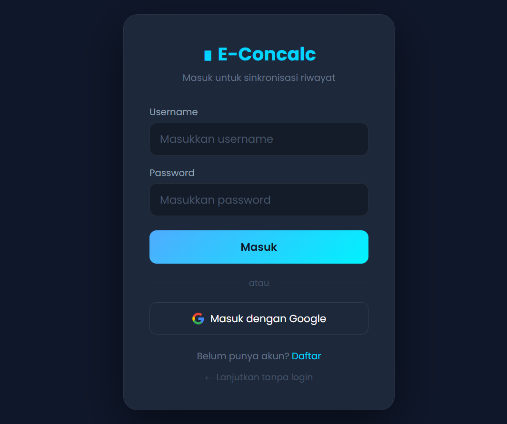
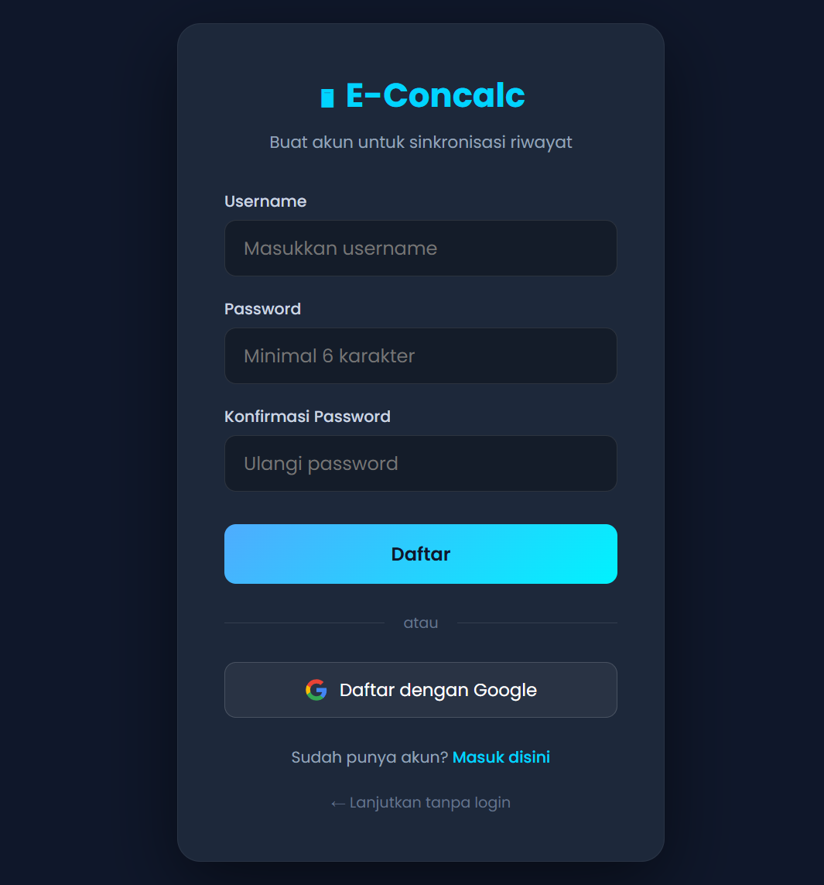
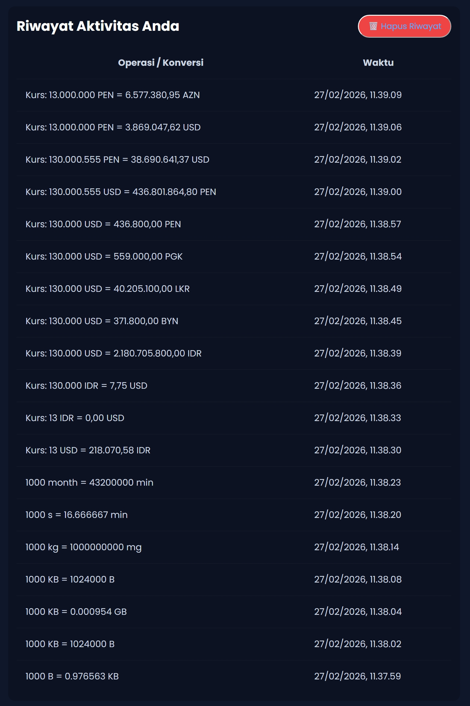

<p align="left">
  
  
  
  
</p>

# E-Concalc Web (Backend & Frontend)

Direktori ini memuat implementasi *Core System* platform E-Concalc. Sistem ini berfungsi sebagai *API Provider* pusat untuk sinkronisasi riwayat lintas platform serta menyediakan antarmuka web kalkulator ilmiah dan konverter.

## 🛡️ Keamanan & Integritas: Input Validation & API Protection

Dalam aplikasi kalkulator berbasis web, validasi input dan proteksi API merupakan aspek krusial untuk mencegah eksploitasi. E-Concalc mengimplementasikan **multi-layer security** baik pada sisi klien maupun server.

### Mengapa Validasi Sisi Server Penting?
- Input yang masuk melalui REST API dapat dimodifikasi oleh klien sebelum dikirim ke server.
- Tanpa validasi server, data riwayat dapat dimanipulasi dengan payload berbahaya (SQL Injection, XSS).
- Token autentikasi harus diverifikasi pada setiap request untuk mencegah akses tidak sah.

### Implementasi Teknis (Snippet)
Server memvalidasi setiap request API menggunakan Laravel Validation dan middleware Sanctum sebelum data disimpan ke database.

```php
// HistoryController.php — Validasi & Penyimpanan Riwayat
public function store(Request $request)
{
    $validated = $request->validate([
        'operasi' => 'required|string|max:500',
        'tipe'    => 'required|in:calc,conv,currency',
    ]);

    $riwayat = $request->user()->riwayat()->create($validated);

    return response()->json([
        'message' => 'History saved',
        'data'    => [
            'id'      => $riwayat->id,
            'operasi' => $riwayat->operasi,
            'tipe'    => $riwayat->tipe,
            'waktu'   => $riwayat->created_at->toISOString(),
        ]
    ], 201);
}
```

---

## 📑 Dokumentasi REST API
Semua interaksi API menggunakan JSON *payload* dan membutuhkan header `Authorization: Bearer <token>` melalui Laravel Sanctum (kecuali endpoint login/register).

| Method | Endpoint | Request Payload (Example) | Deskripsi |
| :--- | :--- | :--- | :--- |
| `POST` | `/api/login` | `{"name": "...", "password": "..."}` | Memperoleh access token user. |
| `POST` | `/api/register` | `{"name": "...", "password": "...", "password_confirmation": "..."}` | Registrasi akun baru + auto-login. |
| `POST` | `/api/login/google` | `{"google_id": "...", "name": "...", "email": "..."}` | Login/Register via Google OAuth. |
| `POST` | `/api/logout` | `-` | Revoke token autentikasi aktif. |
| `GET` | `/api/user` | `-` | Mengambil metadata profil user aktif. |
| `GET` | `/api/history` | `?tipe=calc\|conv\|currency` | Mengambil riwayat (filter opsional). |
| `POST` | `/api/history` | `{"operasi": "2+3=5", "tipe": "calc"}` | Menyimpan riwayat baru. |
| `DELETE` | `/api/history` | `-` | Menghapus semua riwayat user. |
| `DELETE` | `/api/history/{id}` | `-` | Menghapus riwayat spesifik. |

---

## 🏗️ Fitur Keamanan yang Diimplementasikan

| Ancaman | Mitigasi | Implementasi |
| :--- | :--- | :--- |
| **SQL Injection** | Prepared Statements | Eloquent ORM & Query Builder |
| **XSS** | Output Escaping | Blade Template `{{ }}` |
| **CSRF** | Token Verification | `@csrf` directive + middleware |
| **Unauthorized Access** | Token Authentication | Laravel Sanctum `auth:sanctum` |
| **Brute Force** | Rate Limiting | `throttle:60,1` middleware |
| **Data Tampering** | Server-Side Validation | `$request->validate()` |

---

## ⚙️ Local Setup
1. **Dependencies**: `composer install` & `npm install`.
2. **Environment**: Copy `.env.example` ke `.env` dan jalankan `php artisan key:generate`.
3. **Database**: Buat database `ecalc` di MySQL, lalu jalankan `php artisan migrate:fresh`.
4. **Google OAuth** (opsional): Konfigurasi `GOOGLE_CLIENT_ID`, `GOOGLE_CLIENT_SECRET`, dan `GOOGLE_REDIRECT_URI` di `.env`.
5. **Running**:
    - Server: `php artisan serve --port=8080`
    - Assets: `npm run dev` (development) atau `npm run build` (production)

---

## 📸 Antarmuka Web (Gallery)

### 🔐 Auth
| Login | Register |
| :---: | :---: |
|  |  |

### 🧮 Fitur Utama
| Kalkulator Ilmiah | Konverter Satuan | Konverter Mata Uang |
| :---: | :---: | :---: |
|  |  |  |

### 📜 Riwayat
| Riwayat Perhitungan |
| :---: |
|  |
