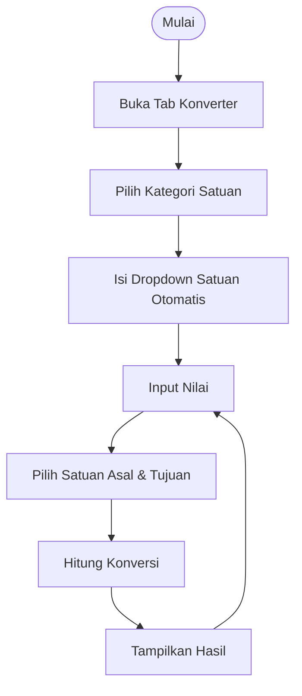
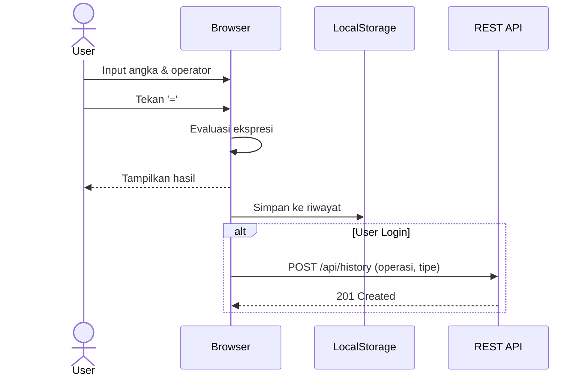
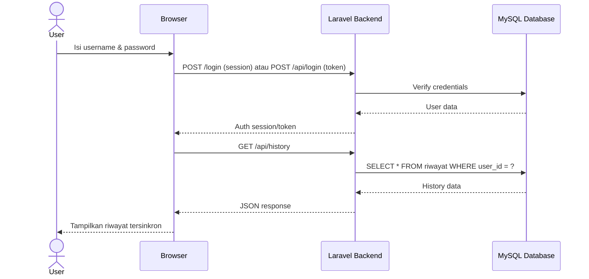
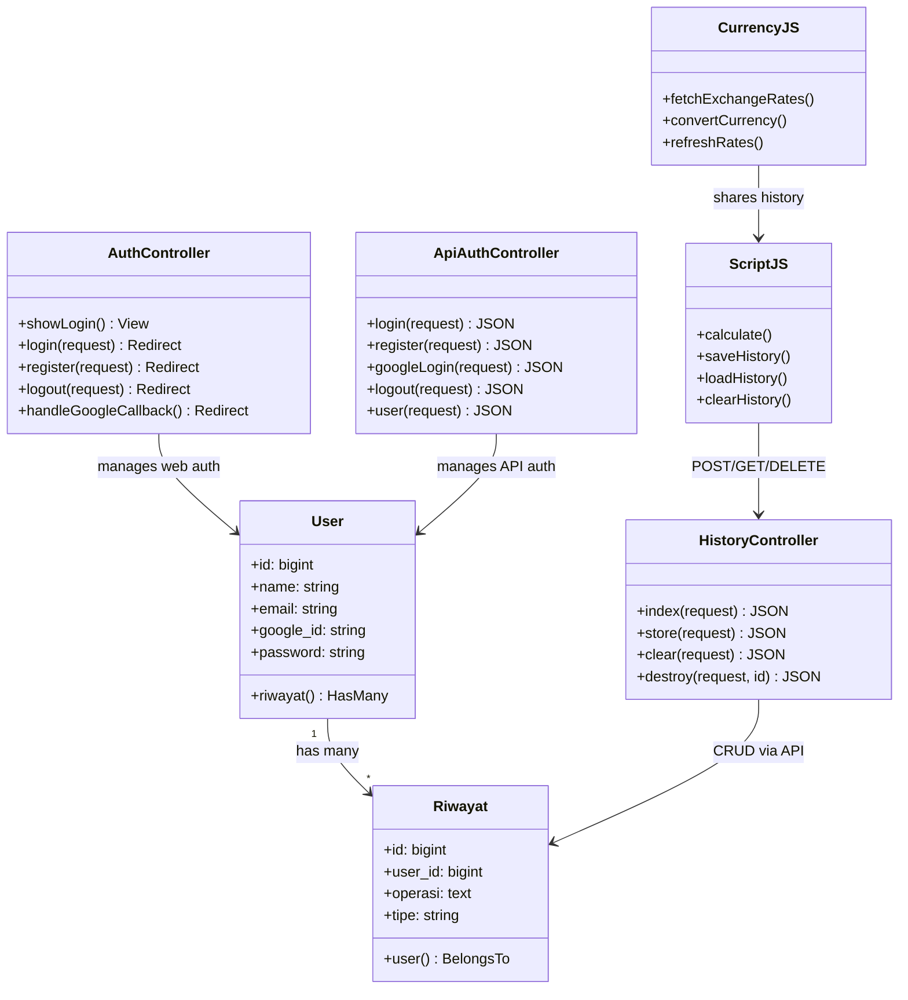

# 📚 Dokumentasi Project (Progress Report)

## E-Concalc Web — Scientific Calculator & Converter Platform

<p align="center">
  
</p>


---

## 📖 Deskripsi

E-Concalc Web adalah platform kalkulator ilmiah dan konverter berbasis web yang dirancang untuk kebutuhan akademik dan penggunaan sehari-hari. Aplikasi ini mendukung **kalkulator ilmiah** lengkap, **konverter satuan** multi-kategori, **konverter mata uang** real-time, serta **autentikasi user** dengan sinkronisasi riwayat lintas platform.

### Tujuan Utama:
- Menyediakan kalkulator ilmiah online yang lengkap dan responsif
- Mendukung konversi satuan untuk berbagai kategori (panjang, berat, suhu, kecepatan, luas, volume)
- Menyediakan konversi mata uang real-time menggunakan API eksternal
- **Autentikasi user** (Login/Register + Google OAuth) untuk sinkronisasi riwayat
- **REST API** untuk sinkronisasi dengan mobile app
- Mendukung instalasi sebagai Progressive Web App (PWA)

### Tech Stack:
- **Backend:** Laravel 10 + Sanctum
- **Frontend:** Blade Templates + Vanilla JavaScript
- **Styling:** Vanilla CSS (Glassmorphism Dark Theme)
- **Database:** MySQL 8.0
- **Auth:** Laravel Sanctum (session + token) + Google OAuth (Socialite)
- **Build:** Vite
- **PWA:** Service Worker + Web App Manifest

---

## 📋 User Story

| ID | User Story | Priority |
|----|------------|----------|
| US-01 | Sebagai user, saya ingin menggunakan kalkulator ilmiah dengan operasi trigonometri, logaritma, dan fungsi memori | High |
| US-02 | Sebagai user, saya ingin menggunakan keyboard untuk input perhitungan agar lebih cepat | High |
| US-03 | Sebagai user, saya ingin toggle antara mode `DEG` dan `RAD` untuk perhitungan trigonometri | Medium |
| US-04 | Sebagai user, saya ingin mengonversi satuan antar berbagai kategori (panjang, berat, suhu, dll.) | High |
| US-05 | Sebagai user, saya ingin mengonversi mata uang dengan kurs real-time | High |
| US-06 | Sebagai user, saya ingin melihat dan menyinkronkan riwayat perhitungan | Medium |
| US-07 | Sebagai user, saya ingin menginstall aplikasi sebagai PWA di perangkat saya | Low |
| US-08 | Sebagai user, saya ingin login/register untuk menyinkronkan riwayat dengan mobile app | High |
| US-09 | Sebagai user, saya ingin login menggunakan akun Google | Medium |
| US-10 | Sebagai guest, saya ingin tetap bisa menggunakan semua fitur tanpa login (localStorage) | Medium |

---

## 📝 SRS - Feature List

### Functional Requirements

| ID | Feature | Deskripsi | Status |
|----|---------|-----------|--------|
| FR-01 | Scientific Calculator | Kalkulator dengan operasi dasar dan ilmiah | ✅ Done |
| FR-02 | 2nd Function Toggle | Tombol 2nd untuk fungsi invers (sin⁻¹, cos⁻¹, tan⁻¹, dll.) | ✅ Done |
| FR-03 | Memory Functions | M+, M-, MR, MC untuk manajemen memori kalkulator | ✅ Done |
| FR-04 | DEG/RAD Mode | Toggle antara mode Degree dan Radian | ✅ Done |
| FR-05 | Keyboard Input | Dukungan input via keyboard fisik | ✅ Done |
| FR-06 | Unit Converter | Konversi antar satuan multi-kategori | ✅ Done |
| FR-07 | Currency Converter | Konversi mata uang dengan kurs real-time | ✅ Done |
| FR-08 | Calculation History | Riwayat perhitungan disinkronkan via REST API (login) / localStorage (guest) | ✅ Done |
| FR-09 | PWA Support | Installable sebagai Progressive Web App | ✅ Done |
| FR-10 | Responsive Design | Tampilan responsif untuk desktop dan mobile | ✅ Done |
| FR-11 | User Authentication | Login/Register dengan username + password | ✅ Done |
| FR-12 | Google OAuth | Login dengan akun Google via Socialite | ✅ Done |
| FR-13 | REST API | API endpoints untuk sinkronisasi dengan mobile app | ✅ Done |
| FR-14 | Guest Mode | Semua fitur bekerja tanpa login (localStorage only) | ✅ Done |

### Non-Functional Requirements

| ID | Requirement | Deskripsi |
|----|-------------|-----------|
| NFR-01 | Performance | Perhitungan instan tanpa loading |
| NFR-02 | Usability | UI intuitif dengan dark theme dan glassmorphism |
| NFR-03 | Offline | Fitur kalkulator dan konverter satuan bekerja offline via PWA |
| NFR-04 | Compatibility | Kompatibel dengan semua browser modern |
| NFR-05 | Security | CSRF protection, Sanctum auth, input validation |

---

## 🗄️ Database Schema

### Tabel `users`
| Kolom | Tipe | Keterangan |
|-------|------|------------|
| `id` | bigint (PK) | Primary key |
| `name` | varchar(255) | Username |
| `email` | varchar(255) | Email (unique) |
| `google_id` | varchar (nullable) | Google OAuth ID |
| `password` | varchar(255) | Hashed password |
| `email_verified_at` | timestamp (nullable) | Verifikasi email |
| `remember_token` | varchar (nullable) | Remember me token |
| `created_at` | timestamp | Waktu registrasi |
| `updated_at` | timestamp | Waktu update terakhir |

### Tabel `riwayat`
| Kolom | Tipe | Keterangan |
|-------|------|------------|
| `id` | bigint (PK) | Primary key |
| `user_id` | bigint (FK → users) | Relasi ke user |
| `operasi` | text | Isi perhitungan (contoh: "2+3=5") |
| `tipe` | varchar(20) | Jenis: `calc`, `conv`, atau `currency` |
| `created_at` | timestamp | Waktu penyimpanan |
| `updated_at` | timestamp | Waktu update |

### Tabel Lainnya
| Tabel | Fungsi |
|-------|--------|
| `personal_access_tokens` | Token Sanctum untuk autentikasi mobile app |
| `sessions` | Session management untuk web auth |
| `password_reset_tokens` | Reset password tokens |

---

## 🔗 REST API Endpoints

### Public (Tanpa Auth)
| Method | Endpoint | Deskripsi |
|--------|----------|-----------|
| `POST` | `/api/login` | Login (username + password) → returns token |
| `POST` | `/api/register` | Register akun baru → returns token |
| `POST` | `/api/login/google` | Login/Register via Google ID → returns token |

### Protected (Auth: Sanctum)
| Method | Endpoint | Deskripsi |
|--------|----------|-----------|
| `GET` | `/api/user` | Info user saat ini |
| `POST` | `/api/logout` | Logout (revoke token) |
| `GET` | `/api/history` | Ambil riwayat (filter: `?tipe=calc\|conv\|currency`) |
| `POST` | `/api/history` | Simpan riwayat baru (`operasi` + `tipe`) |
| `DELETE` | `/api/history` | Hapus semua riwayat |
| `DELETE` | `/api/history/{id}` | Hapus riwayat tertentu |

---

## 📊 UML Diagrams

### 1. Use Case Diagram


---

### 2. Activity Diagram

#### a. Kalkulator Ilmiah


#### b. Konverter Satuan



#### c. Autentikasi


---

### 3. Sequence Diagram

#### a. Kalkulator dengan API Sync



#### b. Login & History Sync



---

### 4. Class Diagram



---

## 🔄 SDLC (Software Development Life Cycle)

**Metodologi:** Waterfall dengan iterasi

| Phase | Aktivitas | Output |
|-------|-----------|--------|
| **1. Planning** | Requirement gathering, user story | PRD, User Stories |
| **2. Analysis** | SRS, feature prioritization | Feature List, SRS Doc |
| **3. Design** | UI mockups, database design, API design | Mockups, ERD, API spec |
| **4. Development** | Coding, unit testing | Source code |
| **5. Testing** | Feature testing, browser testing | Test cases |
| **6. Deployment** | Server setup, deployment | Live application |
| **7. Maintenance** | Bug fixes, feature updates | Patches, updates |

---

## 🚀 Instalasi

### Prerequisites

Pastikan Anda sudah menginstall:
- **PHP** >= 8.1
- **Composer** >= 2.0
- **Node.js** >= 18.0
- **NPM** >= 9.0
- **MySQL** >= 8.0 (via XAMPP atau standalone)
- **Git**

### Langkah 1: Clone Repository

```bash
git clone https://github.com/falcon-ioi/Caclcon.git
cd Caclcon/e-concalc-web
```

### Langkah 2: Install Dependencies

```bash
# Install PHP dependencies
composer install

# Install Node.js dependencies
npm install
```

### Langkah 3: Konfigurasi Environment

```bash
# Copy file environment
cp .env.example .env

# Generate application key
php artisan key:generate
```

**Edit file `.env`** dan sesuaikan konfigurasi database:

```env
DB_CONNECTION=mysql
DB_HOST=127.0.0.1
DB_PORT=3306
DB_DATABASE=ecalc
DB_USERNAME=root
DB_PASSWORD=
```

### Langkah 4: Setup Database

```bash
# Buat database 'ecalc' di phpMyAdmin terlebih dahulu, lalu:
php artisan migrate:fresh
```

### Langkah 5: Build Assets

```bash
# Build untuk production
npm run build

# atau untuk development (dengan hot reload)
npm run dev
```

### Langkah 6: Jalankan Server

```bash
php artisan serve --port=8080
```

Aplikasi akan berjalan di: **http://localhost:8080**

### ⚠️ Troubleshooting

| Error | Solusi |
|-------|--------|
| `Vite manifest not found` | Jalankan `npm run build` |
| `Permission denied` | Jalankan `chmod -R 775 storage bootstrap/cache` |
| `Class not found` | Jalankan `composer dump-autoload` |
| `SQLSTATE Connection refused` | Pastikan MySQL running di XAMPP |
| `CSRF token mismatch` | Clear browser cookies atau `php artisan cache:clear` |

---

## 📁 Struktur Project

```
e-concalc-web/
├── app/
│   ├── Http/
│   │   ├── Controllers/
│   │   │   ├── AuthController.php          # Web auth (login/register/Google)
│   │   │   ├── CalculatorController.php    # Main page controller
│   │   │   └── Api/
│   │   │       ├── AuthController.php      # API auth (Sanctum tokens)
│   │   │       └── HistoryController.php   # API history CRUD
│   │   ├── Kernel.php                      # Middleware registration
│   │   └── Middleware/
│   │       └── VerifyCsrfToken.php         # CSRF exceptions for API
│   └── Models/
│       ├── User.php                        # User model (HasApiTokens)
│       └── Riwayat.php                     # History model
├── database/
│   └── migrations/                         # All table migrations
├── public/
│   ├── css/style.css                       # Stylesheet (dark theme)
│   ├── js/
│   │   ├── script.js                       # Calculator + history API sync
│   │   └── currency.js                     # Currency converter
│   ├── images/                             # Logo & assets
│   ├── manifest.json                       # PWA manifest
│   └── sw.js                               # Service Worker
├── resources/views/
│   ├── auth/
│   │   ├── login.blade.php                 # Login page
│   │   └── register.blade.php             # Register page
│   └── calculator/
│       └── index.blade.php                # Main calculator page
├── routes/
│   ├── web.php                            # Web routes (pages + auth)
│   └── api.php                            # API routes (Sanctum protected)
├── .env                                    # Environment config
├── composer.json
└── vite.config.js
```

---

## 📜 License

MIT License

## 👨‍💻 Author

Developed with ❤️ by **Falcon IOI**
