# 📚 Dokumentasi Project (Progress Report)

## E-Concalc Web — Scientific Calculator & Converter Platform


---

## 📖 Deskripsi
E-Concalc (Electronic Converter & Calculator) adalah platform kalkulator ilmiah dan konverter berbasis web yang dirancang untuk kebutuhan akademik dan penggunaan sehari-hari. Aplikasi ini mendukung **kalkulator ilmiah** lengkap dengan fungsi trigonometri dan memori, **konverter satuan** multi-kategori, **konverter mata uang** real-time, serta **autentikasi user** (Login/Register + Google OAuth) dengan sinkronisasi riwayat lintas platform via REST API.

### Tujuan Utama:
- Menyediakan kalkulator ilmiah online yang lengkap dan responsif
- Mendukung konversi satuan untuk berbagai kategori (panjang, berat, suhu, kecepatan, luas, volume)
- Menyediakan konversi mata uang real-time menggunakan API eksternal
- Mendukung autentikasi user (Login/Register + Google OAuth) untuk sinkronisasi riwayat
- Menyediakan REST API untuk integrasi dengan aplikasi mobile Android
- Mendukung mode Guest tanpa login (localStorage only)
- Mendukung instalasi sebagai Progressive Web App (PWA)

### Tech Stack:
- **Backend:** Laravel 10 + Sanctum
- **Frontend:** Blade Templates + Vanilla JavaScript
- **Styling:** Vanilla CSS (Glassmorphism Dark Theme)
- **Database:** MySQL 8.0
- **Auth:** Laravel Sanctum (session + token) + Google OAuth (Socialite)
- **Build Tool:** Vite
- **PWA:** Service Worker + Web App Manifest

---

## 📋 User Story

| ID | User Story | Priority |
|----|------------|----------|
| US-01 | Sebagai user, saya ingin menggunakan kalkulator ilmiah dengan operasi trigonometri, logaritma, dan fungsi memori | High |
| US-02 | Sebagai user, saya ingin menggunakan keyboard untuk input perhitungan agar lebih cepat | High |
| US-03 | Sebagai user, saya ingin toggle antara mode `DEG` dan `RAD` untuk perhitungan trigonometri | Medium |
| US-04 | Sebagai user, saya ingin mengonversi satuan antar berbagai kategori (panjang, berat, suhu, dll.) | High |
| US-05 | Sebagai user, saya ingin mengonversi mata uang dengan kurs real-time | High |
| US-06 | Sebagai user, saya ingin login/register untuk menyinkronkan riwayat dengan mobile app | High |
| US-07 | Sebagai user, saya ingin login menggunakan akun Google agar lebih praktis | Medium |
| US-08 | Sebagai user, saya ingin melihat dan menyinkronkan riwayat perhitungan di semua perangkat | Medium |
| US-09 | Sebagai guest, saya ingin tetap bisa menggunakan semua fitur tanpa login (localStorage) | Medium |
| US-10 | Sebagai user, saya ingin menginstall aplikasi sebagai PWA di perangkat saya | Low |

---

## 📝 SRS - Feature List

### Functional Requirements

| ID | Feature | Deskripsi | Status |
|----|---------|-----------|--------|
| FR-01 | Scientific Calculator | Kalkulator dengan operasi dasar dan ilmiah | ✅ Done |
| FR-02 | 2nd Function Toggle | Tombol 2nd untuk fungsi invers (sin⁻¹, cos⁻¹, tan⁻¹, dll.) | ✅ Done |
| FR-03 | Memory Functions | M+, M-, MR, MC untuk manajemen memori kalkulator | ✅ Done |
| FR-04 | DEG/RAD Mode | Toggle antara mode Degree dan Radian | ✅ Done |
| FR-05 | Keyboard Input | Dukungan input via keyboard fisik | ✅ Done |
| FR-06 | Unit Converter | Konversi antar satuan multi-kategori | ✅ Done |
| FR-07 | Currency Converter | Konversi mata uang dengan kurs real-time | ✅ Done |
| FR-08 | Calculation History | Riwayat disinkronkan via API (login) / localStorage (guest) | ✅ Done |
| FR-09 | PWA Support | Installable sebagai Progressive Web App | ✅ Done |
| FR-10 | Responsive Design | Tampilan responsif untuk desktop dan mobile | ✅ Done |
| FR-11 | User Authentication | Login/Register dengan username + password | ✅ Done |
| FR-12 | Google OAuth | Login dengan akun Google via Socialite | ✅ Done |
| FR-13 | REST API | Endpoint untuk integrasi dengan aplikasi Mobile | ✅ Done |
| FR-14 | Guest Mode | Semua fitur bekerja tanpa login (localStorage only) | ✅ Done |

### Non-Functional Requirements

| ID | Requirement | Deskripsi |
|----|-------------|-----------|
| NFR-01 | Security | CSRF protection, Sanctum auth, input validation |
| NFR-02 | Performance | Perhitungan instan tanpa loading |
| NFR-03 | Usability | UI intuitif dengan dark theme dan glassmorphism |
| NFR-04 | Offline | Fitur kalkulator dan konverter satuan bekerja offline via PWA |
| NFR-05 | Interoperability | REST API untuk integrasi dengan aplikasi Mobile |

---

## 📊 UML Diagrams

### 1. Use Case Diagram

```mermaid
flowchart TD
    Guest(("👤 Guest"))
    User(("👤 Logged-in User"))

    Guest --> A(["🖩 Kalkulator Ilmiah"])
    Guest --> B(["📐 Konverter Satuan"])
    Guest --> C(["💱 Konverter Mata Uang"])
    Guest --> D(["📜 Riwayat (localStorage)"])
    Guest --> Auth(["🔑 Login / Register"])

    User --> A
    User --> B
    User --> C
    User --> E(["📜 Riwayat (API Sync)"])
    User --> F(["🚪 Logout"])

    A --> A1(["Perhitungan Dasar & Ilmiah"])
    A --> A2(["Toggle DEG / RAD"])
    A --> A3(["Fungsi Memori"])
    A --> A4(["Fungsi 2nd"])
    A --> A5(["Input Keyboard"])

    B --> B1(["Pilih Kategori"])
    B --> B2(["Konversi Nilai"])
    B --> B3(["Swap Satuan"])

    C --> C1(["Konversi 160+ Mata Uang"])
    C --> C2(["Swap Mata Uang"])
    C --> C3(["Refresh Kurs"])
    C3 -.-> API[("🌐 Exchange Rate API")]

    Auth --> Auth1(["Login Username/Password"])
    Auth --> Auth2(["Login Google OAuth"])
    Auth --> Auth3(["Register Akun Baru"])

    E -.-> API2[("🌐 REST API /api/history")]
```



---

### 2. Activity Diagram

#### a. Kalkulator Ilmiah


#### b. Konverter Satuan


#### c. Autentikasi


---

### 3. Sequence Diagram

#### a. Kalkulator dengan API Sync


#### b. Login & History Sync


---

### 4. Class Diagram


### 5. ERD (Entity Relationship Diagram)


---

## 🎨 Mock-Up / Screenshots

### 1. Halaman Login


### 2. Halaman Register


### 3. Kalkulator Ilmiah


### 4. Konverter Satuan


### 5. Konverter Mata Uang


---

## 🔄 SDLC (Software Development Life Cycle)

**Metodologi:** Waterfall dengan iterasi

| Phase | Aktivitas | Output |
|-------|-----------|--------|
| **1. Planning** | Requirement gathering, user story | PRD, User Stories |
| **2. Analysis** | SRS, feature prioritization | Feature List, SRS Doc |
| **3. Design** | UML diagrams, database design, API design | UML, ERD, API Spec |
| **4. Development** | Coding, unit testing | Source code |
| **5. Testing** | Feature testing, browser testing | Test cases |
| **6. Deployment** | Server setup, deployment | Live application |
| **7. Maintenance** | Bug fixes, feature updates | Patches, updates |

### Timeline

```
Minggu 1: Planning & Analysis
Minggu 2: Design (UML, ERD, Mockups)
Minggu 3-4: Development Sprint 1 (Core Features: Calculator, Converter, Currency)
Minggu 5-6: Development Sprint 2 (Auth, API Sync, Google OAuth)
Minggu 7: Development Sprint 3 (Mobile Integration, REST API)
Minggu 8: Testing, PWA & Deployment
```

---

## 🚀 Instalasi

### Prerequisites

Pastikan Anda sudah menginstall:
- **PHP** >= 8.1
- **Composer** >= 2.0
- **Node.js** >= 18.0
- **NPM** >= 9.0
- **MySQL** >= 8.0 (via XAMPP atau standalone)
- **Git**

### Langkah 1: Clone Repository

```bash
git clone https://github.com/falcon-ioi/Caclcon.git
cd Caclcon/e-concalc-web
```

### Langkah 2: Install Dependencies

```bash
# Install PHP dependencies
composer install

# Install Node.js dependencies
npm install
```

### Langkah 3: Konfigurasi Environment

```bash
# Copy file environment
cp .env.example .env

# Generate application key
php artisan key:generate
```

**Edit file `.env`** dan sesuaikan konfigurasi database:

```env
DB_CONNECTION=mysql
DB_HOST=127.0.0.1
DB_PORT=3306
DB_DATABASE=ecalc
DB_USERNAME=root
DB_PASSWORD=

# Google OAuth (opsional)
GOOGLE_CLIENT_ID=your_google_client_id
GOOGLE_CLIENT_SECRET=your_google_client_secret
GOOGLE_REDIRECT_URI=http://localhost:8080/auth/google/callback
```

### Langkah 4: Setup Database

```bash
# Buat database 'ecalc' di phpMyAdmin terlebih dahulu, lalu:
php artisan migrate:fresh
```

### Langkah 5: Build Assets

```bash
# Build untuk production
npm run build

# atau untuk development (dengan hot reload)
npm run dev
```

### Langkah 6: Jalankan Server

```bash
php artisan serve --port=8080
```

Aplikasi akan berjalan di: **http://localhost:8080**

### 🔐 Default Account

| Role | Akses | Keterangan |
|------|-------|------------|
| User | Register via halaman `/register` | Username + password |
| User | Login via Google OAuth | Klik tombol "Login with Google" |
| Guest | Langsung akses `/` | Semua fitur tersedia, riwayat di localStorage |

### ⚠️ Troubleshooting

| Error | Solusi |
|-------|--------|
| `SQLSTATE: Connection refused` | Pastikan MySQL running di XAMPP |
| `Vite manifest not found` | Jalankan `npm run build` |
| `CSRF token mismatch` | Clear cookies atau `php artisan cache:clear` |
| `Permission denied` | Jalankan `chmod -R 775 storage bootstrap/cache` |
| `Class not found` | Jalankan `composer dump-autoload` |

---

## 📁 Struktur Database

```
users                    → Akun user (name, email, google_id, password)
riwayat                  → Riwayat perhitungan terhubung ke user via user_id
personal_access_tokens   → Token Sanctum untuk autentikasi mobile app
sessions                 → Session management untuk web auth
password_reset_tokens    → Token untuk reset password
migrations               → Tracking migrasi Laravel
```

---

## 📡 REST API Endpoints

| Method | Endpoint | Deskripsi |
|--------|----------|-----------|
| POST | `/api/login` | Login dengan username + password |
| POST | `/api/register` | Register akun baru |
| POST | `/api/login/google` | Login/Register via Google ID |
| POST | `/api/logout` | Logout (revoke token) |
| GET | `/api/user` | Mengambil info user saat ini |
| GET | `/api/history` | Mengambil riwayat (filter: `?tipe=calc\|conv\|currency`) |
| POST | `/api/history` | Menyimpan riwayat baru |
| DELETE | `/api/history` | Menghapus semua riwayat |
| DELETE | `/api/history/{id}` | Menghapus riwayat tertentu |

### Contoh Response

**POST /api/login**
```json
{
  "message": "Login successful",
  "user": {
    "id": 1,
    "name": "falcon",
    "email": "falcon@econcalc.local"
  },
  "token": "1|abc123def456..."
}
```

**POST /api/login/google**
```json
{
  "message": "Google login successful",
  "user": {
    "id": 2,
    "name": "John Doe",
    "email": "john@gmail.com"
  },
  "token": "2|xyz789ghi012..."
}
```

**GET /api/history?tipe=calc**
```json
{
  "data": [
    {
      "id": 1,
      "operasi": "sin(45) = 0.7071",
      "tipe": "calc",
      "waktu": "2026-02-25T06:30:00+07:00"
    },
    {
      "id": 2,
      "operasi": "2 + 3 = 5",
      "tipe": "calc",
      "waktu": "2026-02-25T06:25:00+07:00"
    }
  ]
}
```

**POST /api/history**
```json
{
  "message": "History saved",
  "data": {
    "id": 3,
    "operasi": "100 USD = 1,580,000 IDR",
    "tipe": "currency",
    "waktu": "2026-02-25T07:00:00+07:00"
  }
}
```

---

## 📁 Struktur Project

```
e-concalc-web/
├── app/
│   ├── Http/
│   │   ├── Controllers/
│   │   │   ├── AuthController.php          # Web auth (login/register/Google)
│   │   │   ├── CalculatorController.php    # Main page controller
│   │   │   └── Api/
│   │   │       ├── AuthController.php      # API auth (Sanctum tokens)
│   │   │       └── HistoryController.php   # API history CRUD
│   │   ├── Kernel.php                      # Middleware registration
│   │   └── Middleware/
│   │       └── VerifyCsrfToken.php         # CSRF exceptions for API
│   └── Models/
│       ├── User.php                        # User model (HasApiTokens)
│       └── Riwayat.php                     # History model
├── database/
│   └── migrations/                         # All table migrations
├── public/
│   ├── css/style.css                       # Stylesheet (dark theme)
│   ├── js/
│   │   ├── script.js                       # Calculator + history API sync
│   │   └── currency.js                     # Currency converter
│   ├── images/                             # Logo & assets
│   ├── manifest.json                       # PWA manifest
│   └── sw.js                               # Service Worker
├── resources/views/
│   ├── auth/
│   │   ├── login.blade.php                 # Login page
│   │   └── register.blade.php              # Register page
│   └── calculator/
│       └── index.blade.php                 # Main calculator page
├── routes/
│   ├── web.php                             # Web routes (pages + auth)
│   └── api.php                             # API routes (Sanctum protected)
├── .env                                    # Environment config
├── composer.json
└── vite.config.js
```

---

## 📜 License
This project is licensed under the **MIT License** - see the [LICENSE](LICENSE) file for details.

---

## 👨‍💻 Author
**Falcon IOI**
