# 📚 Dokumentasi Project (Progress Report)

## E-Concalc Web — Scientific Calculator & Converter Platform

<p align="center">
  
</p>


---

## 📖 Deskripsi

E-Concalc Web adalah platform kalkulator ilmiah dan konverter berbasis web yang dirancang untuk kebutuhan akademik dan penggunaan sehari-hari. Aplikasi ini mendukung **kalkulator ilmiah** lengkap dengan fungsi trigonometri dan memori, **konverter satuan** multi-kategori, serta **konverter mata uang** real-time.

### Tujuan Utama:
- Menyediakan kalkulator ilmiah online yang lengkap dan responsif
- Mendukung konversi satuan untuk berbagai kategori (panjang, berat, suhu, kecepatan, luas, volume)
- Menyediakan konversi mata uang real-time menggunakan API eksternal
- Mendukung instalasi sebagai Progressive Web App (PWA)
- Menyimpan riwayat perhitungan menggunakan local storage

### Tech Stack:
- **Backend:** Laravel 10
- **Frontend:** Blade Templates + Vanilla JavaScript
- **Styling:** Vanilla CSS (Glassmorphism Dark Theme)
- **Database:** MySQL 8.0
- **Build:** Vite
- **PWA:** Service Worker + Web App Manifest

---

## 📋 User Story

| ID | User Story | Priority |
|----|------------|----------|
| US-01 | Sebagai user, saya ingin menggunakan kalkulator ilmiah dengan operasi trigonometri, logaritma, dan fungsi memori | High |
| US-02 | Sebagai user, saya ingin menggunakan keyboard untuk input perhitungan agar lebih cepat | High |
| US-03 | Sebagai user, saya ingin toggle antara mode `DEG` dan `RAD` untuk perhitungan trigonometri | Medium |
| US-04 | Sebagai user, saya ingin mengonversi satuan antar berbagai kategori (panjang, berat, suhu, dll.) | High |
| US-05 | Sebagai user, saya ingin mengonversi mata uang dengan kurs real-time | High |
| US-06 | Sebagai user, saya ingin melihat riwayat perhitungan yang saya lakukan | Medium |
| US-07 | Sebagai user, saya ingin menginstall aplikasi sebagai PWA di perangkat saya | Low |
| US-08 | Sebagai user, saya ingin menggunakan tombol `2nd` untuk mengakses fungsi sekunder (sin⁻¹, cos⁻¹, dll.) | Medium |

---

## 📝 SRS - Feature List

### Functional Requirements

| ID | Feature | Deskripsi | Status |
|----|---------|-----------|--------|
| FR-01 | Scientific Calculator | Kalkulator dengan operasi dasar dan ilmiah | ✅ Done |
| FR-02 | 2nd Function Toggle | Tombol 2nd untuk fungsi invers (sin⁻¹, cos⁻¹, tan⁻¹, dll.) | ✅ Done |
| FR-03 | Memory Functions | M+, M-, MR, MC untuk manajemen memori kalkulator | ✅ Done |
| FR-04 | DEG/RAD Mode | Toggle antara mode Degree dan Radian | ✅ Done |
| FR-05 | Keyboard Input | Dukungan input via keyboard fisik | ✅ Done |
| FR-06 | Unit Converter | Konversi antar satuan multi-kategori | ✅ Done |
| FR-07 | Currency Converter | Konversi mata uang dengan kurs real-time | ✅ Done |
| FR-08 | Calculation History | Riwayat perhitungan disimpan di local storage | ✅ Done |
| FR-09 | PWA Support | Installable sebagai Progressive Web App | ✅ Done |
| FR-10 | Responsive Design | Tampilan responsif untuk desktop dan mobile | ✅ Done |

### Non-Functional Requirements

| ID | Requirement | Deskripsi |
|----|-------------|-----------|
| NFR-01 | Performance | Perhitungan instan tanpa loading |
| NFR-02 | Usability | UI intuitif dengan dark theme dan glassmorphism |
| NFR-03 | Offline | Fitur kalkulator dan konverter satuan bekerja offline via PWA |
| NFR-04 | Compatibility | Kompatibel dengan semua browser modern |
| NFR-05 | Security | CSRF protection, input validation |

---

## 📊 UML Diagrams

### Use Case Diagram

```mermaid
flowchart LR
    User(("👤 User"))

    subgraph UC_CALC ["🖩 Kalkulator Ilmiah"]
        UC1["Melakukan Perhitungan Dasar\n+, -, ×, ÷, %"]
        UC2["Menggunakan Fungsi Ilmiah\nsin, cos, tan, log, ln, √"]
        UC3["Toggle Mode DEG / RAD"]
        UC4["Toggle Fungsi 2nd\nsin⁻¹, cos⁻¹, tan⁻¹, eˣ"]
        UC5["Menggunakan Memori\nMC, MR, M+, M-"]
        UC6["Input via Keyboard"]
    end

    subgraph UC_CONV ["📐 Konverter Satuan"]
        UC7["Pilih Kategori Satuan\npanjang, berat, suhu, waktu,\nkecepatan, luas, volume, data,\nenergi, gaya, sudut, frekuensi, daya"]
        UC8["Konversi Antar Satuan"]
        UC9["Swap Satuan Asal & Tujuan"]
    end

    subgraph UC_CURR ["💱 Konverter Mata Uang"]
        UC10["Konversi Mata Uang\n160+ mata uang dunia"]
        UC11["Swap Mata Uang"]
        UC12["Refresh Kurs Terbaru"]
    end

    subgraph UC_OTHER ["📱 Fitur Umum"]
        UC13["Melihat Riwayat Perhitungan"]
        UC14["Menghapus Riwayat"]
        UC15["Install sebagai PWA"]
        UC16["Ganti Tema Dark / Light"]
    end

    User --> UC_CALC
    User --> UC_CONV
    User --> UC_CURR
    User --> UC_OTHER

    UC10 -. "fetch API" .-> API["🌐 ExchangeRate API\napi.exchangerate-api.com"]
```



### Activity Diagram - Alur Utama Aplikasi


### Sequence Diagram - Interaksi Ketiga Fitur


### Class Diagram


---

## 🎨 Mock-Up / Screenshots

> **Catatan:** Screenshot akan ditambahkan setelah mockup tersedia.

### 1. Halaman Kalkulator
<!--  -->

### 2. Halaman Konverter Satuan
<!--  -->

### 3. Halaman Konverter Mata Uang
<!--  -->

---

## 🔄 SDLC (Software Development Life Cycle)

**Metodologi:** Waterfall dengan iterasi

| Phase | Aktivitas | Output |
|-------|-----------|--------|
| **1. Planning** | Requirement gathering, user story | PRD, User Stories |
| **2. Analysis** | SRS, feature prioritization | Feature List, SRS Doc |
| **3. Design** | UI mockups, database design | Mockups, ERD |
| **4. Development** | Coding, unit testing | Source code |
| **5. Testing** | Feature testing, browser testing | Test cases |
| **6. Deployment** | Server setup, deployment | Live application |
| **7. Maintenance** | Bug fixes, feature updates | Patches, updates |

---

## 🚀 Instalasi

### Prerequisites

Pastikan Anda sudah menginstall:
- **PHP** >= 8.1
- **Composer** >= 2.0
- **Node.js** >= 18.0
- **NPM** >= 9.0
- **MySQL** >= 8.0
- **Git**

### Langkah 1: Clone Repository

```bash
git clone https://github.com/falcon-ioi/Caclcon.git
cd Caclcon/e-concalc-web
```

### Langkah 2: Install Dependencies

```bash
# Install PHP dependencies
composer install

# Install Node.js dependencies
npm install
```

### Langkah 3: Konfigurasi Environment

```bash
# Copy file environment
cp .env.example .env

# Generate application key
php artisan key:generate
```

**Edit file `.env`** dan sesuaikan konfigurasi database:

```env
DB_CONNECTION=mysql
DB_HOST=127.0.0.1
DB_PORT=3306
DB_DATABASE=ecalc
DB_USERNAME=root
DB_PASSWORD=
```

### Langkah 4: Build Assets

```bash
# Build untuk production
npm run build

# atau untuk development (dengan hot reload)
npm run dev
```

### Langkah 5: Jalankan Server

```bash
php artisan serve
```

Aplikasi akan berjalan di: **http://localhost:8000**

### ⚠️ Troubleshooting

| Error | Solusi |
|-------|--------|
| `Vite manifest not found` | Jalankan `npm run build` |
| `Permission denied` | Jalankan `chmod -R 775 storage bootstrap/cache` |
| `Class not found` | Jalankan `composer dump-autoload` |

---

## 📁 Struktur Project

```
e-concalc-web/
├── app/
│   └── Http/Controllers/        # Controller (CalculatorController)
├── public/
│   ├── css/style.css            # Stylesheet utama (dark theme)
│   ├── images/                  # Logo & banner
│   ├── manifest.json            # PWA manifest
│   └── sw.js                    # Service Worker
├── resources/
│   └── views/
│       └── calculator/          # Blade templates
├── routes/
│   └── web.php                  # Route definitions
├── composer.json
├── vite.config.js
└── ...
```

---

## 📜 License

MIT License

## 👨‍💻 Author

Developed with ❤️ by **Falcon IOI**
